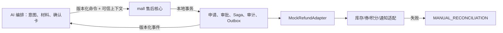

# P6 售后闭环设计

## 目标

冻结 P6 的跨服务写操作边界：mall 作为唯一事实源，以规则固定、人工审批、Mock 退款、Saga 和人工对账完成可恢复售后闭环；AI 只执行受控命令编排。

## 设计

采用单一公共契约 `contracts/standards/aftersale-p6.md`，由 A 实现售后申请、审批、Saga 与事件持久化，B 实现意图到确认卡/命令的受控路径，C 实现 Mock 退款与补偿适配。订单取消继续复用现有 portal 服务，退款不复用退货申请状态。

申请创建即冻结规则版本和授权快照。未支付订单在用户确认后取消；已支付退款/退货先进入客服审批，金额大于等于 `500.00` 或任何高风险规则进入主管审批。退款超时为 `UNKNOWN` 且必须查询；退款成功后权益失败转人工对账，不反向退款。

## 数据流

## 不在范围内

不接入真实支付渠道，不修改已有事件 payload，不让 AI 直写 mall 数据库，不实现管理端页面，不在 P6 冻结阶段执行业务代码。
