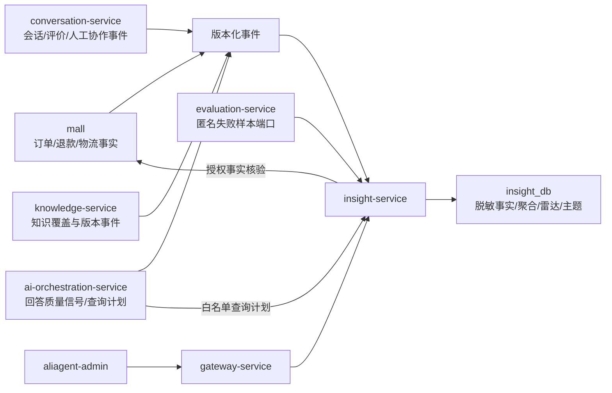

# P9 运营洞察设计

## 1. 文档目标

本文冻结 P9“运营洞察”的范围、边界、指标口径、数据模型、异常检测、主题与知识缺口分析、受控自然语言查询、权限、安全和验收标准。

P9 的目标是把分散在 `mall`、会话、AI、知识和评测链路中的版本化事件转换为可追溯的运营指标与问题雷达。P9 不替代各业务服务的事实职责，也不保存完整订单或个人敏感资料。

P9 阶段出口：

- 运营人员可从“问题雷达”发现异常，查看趋势、聚合维度和匿名样本。
- 每个指标、雷达和主题均可追溯到口径版本、数据截止时间、聚合修订版本和匿名证据。
- 系统能够识别投诉主题与知识缺口，但不会自动创建或发布知识内容。
- 自然语言查询只能生成白名单指标查询计划，禁止生成或执行任意 SQL。
- 跨租户访问、敏感维度查询和未授权订单核验被明确拒绝。

## 2. 范围与非目标

### 2.1 P9 范围

1. 版本化事件摄入、Inbox 幂等、匿名化与脱敏事实。
2. 小时增量聚合、日终固化、迟到事件修订和人工重算清单。
3. 退款、转人工、客服响应、满意度、知识缺口和物流问题等核心指标。
4. 趋势基线、绝对安全阈值、问题雷达及轻量处置闭环。
5. 规则分类、向量聚类、AI 主题命名和高风险主题审核。
6. 受控指标语义层、自然语言查询计划和授权订单核验。
7. 运营后台的问题雷达、指标总览、主题与知识缺口、自然语言查询页面。

### 2.2 P9 非目标

- 不提供跨租户行业基准或跨租户聚合。
- 不允许 AI 直接查询数据库、生成 SQL、修改指标口径或改变聚类成员。
- 不自动创建、修改或发布知识内容。
- 不在 `insight_db` 保存完整订单、手机号、地址、支付资料、消费者身份或原始敏感对话。
- 不把洞察结果写回为订单、退款、物流、库存或审批事实。
- 不建设通用 BI 平台、任意报表设计器或任意维度下钻。
- 不在 P9 自动执行退款、补偿、封禁等业务操作。

## 3. 方案选择

### 3.1 采用方案：中心化洞察服务 + 版本化事件 + 受控核验 API

`insight-service` 独占 `insight_db`，消费其他服务发布的版本化事件，负责脱敏事实、聚合、异常检测、主题分析、知识缺口、问题雷达和受控查询。需要具体订单事实时，通过受控 `mall` API 临时核验。

选择原因：

- 保持数据库私有，避免跨服务共享表造成强耦合。
- 指标口径、修订和雷达处置集中治理，便于审计。
- 事件事实可以重放和修订，适合小时增量与日终固化。
- 具体订单核验仍由 `mall` 验证租户、权限和数据归属。

### 3.2 未采用方案

**各服务自行聚合再由前端拼接**：实现初期简单，但指标口径、时间窗口和修订版本容易不一致，难以形成统一雷达。

**洞察服务直接读取各服务数据库**：查询灵活，但破坏数据库私有边界、租户隔离和可演进性，不采用。

**引入独立数仓或 Elasticsearch 作为 P9 主存储**：可扩展性更强，但当前规模下会增加部署和运维复杂度。P9 先使用 PostgreSQL、pgvector 和明确的聚合表；后续只有在容量证据充分时再通过 ADR 演进。

## 4. 总体架构与职责



### 4.1 `insight-service`

- 独占 `insight_db` 及其数据库账号。
- 校验事件信封、事件版本、租户和必要字段。
- 在同一数据库事务中写入 Inbox 与脱敏事实。
- 维护小时聚合、日聚合、指标定义版本和聚合修订版本。
- 执行趋势基线、绝对阈值检测和问题雷达去重合并。
- 执行规则分类、向量聚类、AI 命名、主题审核和知识缺口分析。
- 校验并执行受控查询计划。
- 只通过服务 JWT 和用户身份快照调用 `mall` 核验 API。

### 4.2 事实来源服务

- `mall`：订单创建/支付、退款成功、物流异常、金额和类目事实来源。
- `conversation-service`：有效会话、会话完成、显式评价、转人工、首次人工公开回复事实来源。
- `ai-orchestration-service`：RAG 命中、拒答、引用、工具失败等回答质量信号；自然语言仅转换为受控查询计划。
- `knowledge-service`：知识发布版本、覆盖范围和知识条目标识的事实来源。
- `evaluation-service`：只通过版本化端口提供匿名失败样本，不允许 `insight-service` 读取 `evaluation_db`。

### 4.3 前端入口

`aliagent-admin` 默认首页为“问题雷达”。指标总览、主题与知识缺口、自然语言查询为二级入口。页面采用已确认的高对比度规范：浅色卡片、深色正文、高对比蓝色标签，以及边界清晰的浅绿/浅红状态区域；不得使用与卡片背景明度接近的正文颜色。

## 5. 事件与数据流

### 5.1 事件信封

所有 P9 事件沿用平台事件信封，至少包含：

- `eventId`
- `eventType`
- `eventVersion`
- `occurredAt`
- `tenantId`
- `traceId`
- `producer`
- `payload`

生产者跨服务写事件必须使用 Outbox；消费者使用 Inbox 实现幂等。已有 v1 契约不得直接追加必填字段，新增语义使用新 Topic 和新事件版本。

### 5.2 P9 所需业务信号

集成实施前冻结最终 AsyncAPI 和 JSON Schema。至少覆盖下列语义：

| 来源 | 事件语义 | P9 用途 |
|---|---|---|
| `mall` | 已支付订单 | 退款率、退款金额率分母和订单归属周期 |
| `mall` | 退款成功 | 退款率、退款金额率分子和退款原因 |
| `mall` | 物流异常 | 物流问题率、物流主题与雷达 |
| `conversation-service` | 会话完成 | 有效会话、转人工率分母和主题分析窗口 |
| `conversation-service` | 显式用户评价 | 满意度、评价覆盖率和负向样本 |
| `conversation-service` | 请求人工 | 转人工率、客服响应计时起点 |
| `conversation-service` | 首次人工公开回复 | 客服响应时长终点 |
| `ai-orchestration-service` | 回答质量信号 | 未命中、低置信拒答、缺引用等知识缺口 |
| `ai-orchestration-service` | 工具失败 | AI 工具故障主题和异常趋势 |
| P7 副驾 | 建议采纳/修改/拒绝 | 客服大幅修改信号和知识缺口 |
| `knowledge-service` | 知识发布或覆盖版本变化 | 知识缺口关联和效果对比 |

P8 已存在的 `conversation.completed.v1`、`conversation.feedback.received.v1`、`conversation.human.requested.v1`、`ai.tool.failed.v1`、`copilot.suggestion.actioned.v1` 保持兼容。若现有 payload 不足以支持 P9，创建新版本，不直接扩写旧版本的必填字段。

### 5.3 脱敏事实

事件进入 `insight-service` 后先完成契约和租户校验，再投影为最小匿名事实：

- 不保存手机号、姓名、地址、支付账号、原始订单号和消费者 ID。
- 文本只保留脱敏后的必要片段，先执行规则脱敏，再用于分类或向量化。
- 订单关联使用由 `mall` 生成、仅 `mall` 可解析的租户级 `evidenceRef`；`insight-service` 不具备反解能力。
- 会话、知识和客服关联使用租户级匿名引用，不跨租户复用。
- 类目、退款原因、物流异常类型等维度使用稳定的非敏感编码。
- 原始事件 payload 不作为长期审计副本保存；持久化内容以规范化、脱敏后的事实为准。

### 5.4 摄入事务与确认

1. 校验事件信封、契约版本、允许的生产者和 `tenantId`。
2. 根据 `eventId + producer` 写入 Inbox；重复事件返回已处理结果，不重复聚合。
3. 在同一事务写入规范化事实、必要的修订关系和聚合待处理标记。
4. 事务提交后才确认消息。
5. 无法解析或违反契约的事件进入死信流程并记录安全审计，不创建部分事实。

## 6. 数据模型

P9 的具体 Flyway 由集成会话统一落地。逻辑模型如下：

| 数据域 | 核心数据 | 关键约束 |
|---|---|---|
| Inbox | 事件 ID、生产者、类型、版本、处理状态、首次/最后接收时间 | `tenant_id + producer + event_id` 唯一 |
| 匿名事实 | 事实类型、发生时间、维度、数值、匿名引用、来源事件 | 每行必须有 `tenant_id` 和来源事件引用 |
| 事实修订 | 旧事实、新事实、修订原因、来源事件 | 保留版本关系，不覆盖历史事实 |
| 小时聚合 | 指标、维度、小时窗口、数值、修订版本 | 租户、指标版本、窗口和维度唯一 |
| 日聚合 | 指标、维度、业务日、数值、固化/修订状态 | 支持日终固化和后续修订 |
| 指标定义 | 名称、分子、分母、时间语义、维度白名单、版本 | 已发布版本不可变 |
| 阈值规则 | 指标、维度、绝对阈值、趋势参数、风险级别、版本 | 修改生成新版本，不覆盖旧规则 |
| 问题雷达 | 指标版本、阈值版本、基线、触发原因、证据摘要、状态 | 乐观锁；固定触发时使用的所有版本 |
| 雷达操作 | 确认、解决、忽略、操作者、原因、时间 | 追加写审计，不覆盖历史操作 |
| 主题聚类 | 聚类版本、规则类别、成员摘要、置信度、名称、风险级别 | AI 不得修改成员和风险分类 |
| 主题审核 | 待审核内容、决定、主管、原因、时间 | 高风险主题发布前必须存在批准记录 |
| 知识缺口 | 缺口类型、匿名证据、关联知识版本、趋势、状态 | 不直接创建知识内容 |
| 重算清单 | 迟到事件、影响窗口、原因、状态、操作人 | 超过自动重算窗口时创建 |
| 安全审计 | 受控查询、订单核验、拒绝原因、主体和请求追踪 | 不记录完整查询结果或敏感事实 |

所有业务表必须显式包含 `tenant_id`；唯一键、查询条件和关联键均包含租户范围。禁止仅依赖应用层过滤实现租户隔离。

## 7. 聚合、修订与保留

### 7.1 更新节奏

- 小时增量：按事件发生时间更新小时聚合，面向当天运营监控。
- 日终固化：按租户业务时区固化日聚合，生成可追溯的日版本。
- 迟到修订：接收时间相对 `occurredAt` 不超过 7 天时自动滚动重算受影响窗口。
- 人工重算：迟到超过 7 天时写入重算清单，不静默修改历史结果。

“7 天”限制描述事件到达延迟，不限制业务结果的自然发生时间。例如，订单创建 30 天后发生的正常退款仍归属原订单周期；只要退款事件本身准时到达，就按正常业务修订处理。所有历史修订必须生成新聚合版本并保留旧版本关系。

### 7.2 保留策略

| 数据 | 保留时间 |
|---|---|
| 匿名事件事实、匿名文本片段、聚类成员和向量 | 90 天 |
| 小时聚合 | 180 天 |
| 日聚合 | 2 年 |
| 雷达处置、主题审核、指标/阈值版本、安全审计 | 长期保存，不在 P9 自动删除 |

保留清理按租户和时间分批执行，必须可重入、可观测，并避免删除仍被未完成雷达或人工重算清单引用的必要证据摘要。事实过期后，长期记录只保留聚合证据和不可反解的摘要，不保留原始文本。

## 8. 指标口径

所有指标返回时必须包含：指标定义版本、统计周期、租户业务时区、数据截止时间、聚合修订版本、分子、分母和评价覆盖信息（若适用）。

### 8.1 退款率

按订单归属周期统计：周期内创建且已支付的有效订单中，最终发生退款成功的订单占比。

```text
退款率 = 最终退款成功订单数 / 周期内创建且已支付有效订单数
```

退款事件发生在后续周期时，修订原订单归属周期。取消但未支付订单不进入分母；仅提交退款申请、审批通过或退款处理中均不计为退款成功。

### 8.2 退款金额率

```text
退款金额率 = 上述订单的退款成功金额 / 上述订单的实付金额
```

部分退款按实际退款成功金额累计，但订单数退款率中同一订单只计一次。金额由 `mall` 提供，P9 不推算价格或退款结论。

### 8.3 转人工率

```text
转人工率 = 进入人工队列的有效消费者会话数 / 有效消费者会话数
```

同一会话多次进入队列在会话级指标中只计一次；重复事件由 Inbox 幂等。

### 8.4 客服响应时长

从会话首次进入人工队列到首次人工公开回复的时长。AI 消息、内部备注、AI 副驾建议和系统通知不作为人工公开回复。

至少输出中位数、P90 和有效样本数；无人工回复的会话单独统计未响应数量，不以零时长填充。

### 8.5 满意度与评价覆盖率

满意度只使用显式用户评价，不推断未评价用户的满意度。

```text
满意度 = 显式正向评分数 / 显式有效评分数
评价覆盖率 = 显式有效评分会话数 / 可评价的已完成会话数
```

未评价会话不进入满意度分母，但必须通过评价覆盖率展示，防止少量评分造成误导。

### 8.6 知识缺口率

知识缺口信号包括：

- RAG 未命中。
- 低置信度拒答。
- 应引用但缺少有效知识引用。
- 客服对 AI 副驾建议进行大幅修改或拒绝。
- 同类问题频繁转人工。
- 用户显式标记回答无效。

```text
知识缺口率 = 命中任一已发布缺口规则的有效问答会话数 / 可评估的有效问答会话数
```

规则必须版本化；同一会话命中多个规则，在总体会话率中只计一次，在原因分布中可分别计数。

### 8.7 物流问题率

```text
物流问题率 = 出现物流异常事件或物流相关有效投诉的订单数 / 有效发货订单数
```

物流事实以 `mall` 和受控物流适配层事件为准；模型识别的投诉只能作为问题信号，不能生成物流状态事实。

## 9. 异常检测与问题雷达

### 9.1 检测规则

异常检测同时使用：

1. 7 天和 28 天同周期趋势基线，用于识别相对异常。
2. 绝对安全阈值，用于发现即使历史一直较差也必须报警的问题。

趋势与阈值均按指标和允许维度配置。维度样本不足时不输出强结论，而是标记“样本不足”。不使用跨租户数据补足基线。

### 9.2 雷达生成与去重

每条雷达固定保存：

- 指标定义版本。
- 阈值规则版本。
- 当前统计窗口和基线窗口。
- 聚合修订版本。
- 触发原因、风险级别和证据摘要。

同一租户、问题类型、维度组合和检测窗口内的重复触发合并到同一雷达，更新最新证据和触发次数，不产生通知风暴。若指标修订后不再满足条件，系统记录“数据修订解除”，但不删除原触发记录。

### 9.3 轻量处置闭环

允许的状态迁移：

```text
OPEN -> ACKNOWLEDGED -> RESOLVED
OPEN -> IGNORED
```

- 运营人员可以查看雷达和匿名证据。
- 主管可以确认、解决、忽略雷达并填写原因。
- 非法状态迁移返回冲突错误。
- 更新使用乐观锁，所有操作追加写入雷达操作审计。
- `RESOLVED` 和 `IGNORED` 不删除历史；相同问题在新窗口再次触发时创建新的雷达周期。

## 10. 主题聚类与知识缺口

### 10.1 分析流程

1. 对脱敏文本执行确定性规则分类，优先识别已知问题类型和高风险类别。
2. 对剩余匿名文本使用固定版本的 Embedding 模型生成向量，并在同一租户内按问题类型和时间窗口聚类。
3. AI 只根据脱敏代表样本为聚类生成名称和摘要。
4. 系统按聚类稳定度、样本数和命名置信度决定发布或进入审核。

每个聚类保存规则版本、Embedding 模型版本、聚类参数版本和成员快照版本，以支持重放和对比。

### 10.2 AI 权限边界

AI 不得：

- 增删或移动聚类成员。
- 修改规则确定的风险类别。
- 生成订单、退款、物流或金额事实。
- 根据未脱敏文本命名主题。
- 自动创建或发布知识内容。

模型不可用时，聚类和指标继续运行；主题使用确定性临时标签并进入“待命名”，不得阻塞雷达。

### 10.3 主题发布审核

- 普通主题达到冻结的样本数、稳定度和命名置信度阈值后可自动发布。
- 隐私、欺诈、监管、资金类主题必须由主管审核后发布。
- 审核只能接受、重命名或拒绝展示，不得借审核界面改变聚类成员。
- 所有主题发布和审核操作记录模型版本、提示词版本、输入摘要和决定人。

### 10.4 知识缺口输出

知识缺口关联问题主题、信号来源、当前知识版本、趋势和匿名证据。运营人员可以将其标记为已确认或忽略；知识内容的创建、审核和发布仍由 `knowledge-service` 的既有流程完成。

## 11. 受控自然语言查询

### 11.1 查询计划

`ai-orchestration-service` 只把用户问题转换为白名单查询计划，例如：

```json
{
  "metric": "refund_rate",
  "timeRange": "LAST_7_DAYS",
  "dimensions": ["category", "refund_reason"],
  "filters": {
    "categoryId": "anonymous-category-id"
  },
  "comparison": "PREVIOUS_PERIOD"
}
```

计划中禁止出现 SQL、表名、列名、函数、连接条件或任意表达式。

### 11.2 服务端校验

`insight-service` 必须重新校验：

- 指标是否已发布并允许当前角色访问。
- 时间范围和比较周期是否在白名单内。
- 维度与筛选是否属于指标定义版本的白名单。
- 所有请求是否属于可信 `tenantId`。
- 是否包含手机号、地址、消费者身份等禁止维度。
- 查询复杂度、最大时间跨度、最大分组数和返回行数是否符合限制。

模型生成的计划不因格式合法而自动可信。校验失败返回明确的可选指标、维度或时间范围，不降级为任意 SQL。

### 11.3 查询结果

结果必须包含指标定义、统计周期、截止时间、修订版本、样本量、证据维度和限制说明。自然语言总结只能基于结构化查询结果，不得补造缺失事实。

### 11.4 授权订单核验

运营默认只能查看聚合维度与匿名样本。主管需要核验具体订单时必须提供：

- 问题雷达 ID。
- 核验原因。
- `mall` 生成的匿名 `evidenceRef`。

`insight-service` 携带短期服务 JWT、用户身份快照、可信租户和请求追踪调用 `mall`。`mall` 再验证角色、权限、租户和数据归属。具体订单结果只用于当前响应，不写入 `insight_db`，安全审计只记录谁在何时因何雷达执行了核验，不记录完整订单内容。

## 12. 权限与租户隔离

| 能力 | 运营人员 | 主管 |
|---|---:|---:|
| 查看指标、趋势、雷达和匿名样本 | 允许 | 允许 |
| 使用受控自然语言指标查询 | 允许 | 允许 |
| 修改阈值规则 | 禁止 | 允许 |
| 处置雷达 | 禁止 | 允许 |
| 审核高风险主题 | 禁止 | 允许 |
| 核验具体订单 | 禁止 | 允许，且必须绑定雷达和原因 |

Gateway 移除客户端伪造的内部身份头并注入可信 `tenantId`、主体、角色、权限、`traceId` 和 `requestId`。服务间调用同时验证短期服务 JWT 与用户身份快照。

所有数据访问必须在存储查询、唯一约束、缓存键、任务分片和 API 校验中包含 `tenantId`。跨租户对象存在与否不得通过错误差异泄露；对外统一返回无权限或不存在。

## 13. 故障与降级策略

- **重复事件**：Inbox 返回已处理结果，不重复写事实或触发雷达。
- **契约错误**：拒绝入库，进入死信和安全审计，不创建部分事实。
- **消息系统故障**：生产者 Outbox 保留事件并重试；消费者恢复后从 Inbox 状态继续。
- **聚合任务中断**：使用租户级检查点和幂等聚合版本恢复，不覆盖已固化结果。
- **迟到超过 7 天**：进入人工重算清单，不静默修改。
- **Embedding 或模型故障**：指标和规则分类继续；聚类延后或主题标记待命名。
- **自然语言解析失败**：返回受支持指标和筛选建议，不执行猜测查询。
- **`mall` 不可用**：拒绝具体订单核验，保留聚合洞察，不生成订单事实。
- **阈值配置无效**：拒绝发布新版本，继续使用最后一个有效版本。
- **样本不足**：明确显示样本不足，不输出高置信异常结论。
- **权限或租户校验失败**：拒绝请求并记录安全审计，不返回敏感细节。

## 14. API 与页面设计

P9 API 采用 `/api/v1/insights/**` 外部路由和 `/internal/api/v1/insights/**` 内部路由。最终路径由集成会话冻结 OpenAPI，但至少包含：

- 问题雷达列表、详情、趋势、匿名证据和状态操作。
- 指标总览、分组趋势、定义版本和修订信息。
- 主题与知识缺口列表、详情、审核和处置。
- 受控查询计划校验与执行。
- 主管订单核验。
- 内部事件摄入、重算任务和匿名失败样本适配端口。

前端页面：

1. **问题雷达首页**：按风险、状态和时间展示雷达，突出触发原因、趋势和处置入口。
2. **指标总览**：展示核心指标、样本量、评价覆盖率、同比/环比和修订状态。
3. **主题与知识缺口**：展示聚类趋势、规则类别、审核状态和关联知识版本。
4. **自然语言查询**：显示解析后的查询计划，用户确认后执行；结果同步显示口径和截止时间。

页面不展示完整原始对话或完整订单数据。匿名样本必须有“已脱敏”标识；主管订单核验结果采用临时展示，不进入浏览器持久缓存。

## 15. 测试与验收

### 15.1 单元与契约测试

- 事件信封、事件版本、必填字段和生产者白名单校验。
- Inbox 重复投递与并发幂等。
- 脱敏规则确保敏感字段不会进入事实、日志或向量输入。
- 每个指标使用固定夹具验证分子、分母、归属周期和边界条件。
- 雷达阈值、趋势基线、去重合并和状态机。
- 查询计划白名单、复杂度限制和 SQL/敏感维度拒绝。
- 高风险主题必须审核，AI 无权修改聚类成员。

### 15.2 数据库测试

- `insight_db` 空库 Flyway 全量迁移。
- 所有业务表、唯一键、外键和查询路径包含 `tenant_id`。
- 小时增量、日终固化、7 天滚动重算和历史版本保留。
- 90 天/180 天/2 年保留清理可重入且不误删长期审计。
- 两个租户使用相同匿名业务标识时仍完全隔离。

### 15.3 端到端验收

1. 已支付订单与退款成功事件能按订单归属周期生成可追溯退款率。
2. 重复退款事件不重复计数；迟到事件生成新修订版本。
3. 会话完成、转人工和首次人工回复形成正确的转人工率和客服响应分布。
4. 显式评分影响满意度；未评价只影响评价覆盖率。
5. RAG 未命中和客服大幅修改形成知识缺口，且不自动发布知识。
6. 趋势异常或绝对阈值触发雷达，同窗口重复信号被合并。
7. 高风险主题在主管批准前不可发布。
8. 自然语言查询只执行白名单计划，SQL、敏感维度和越权维度被拒绝。
9. 运营人员不能核验具体订单；主管绑定雷达和原因后可临时核验。
10. `mall` 或模型故障时系统明确降级，不虚构订单、金额或主题结论。
11. 跨租户 API、事件、缓存和聚合访问全部拒绝。
12. 所有 `test-` / `rag-test-` 数据和临时 schema 在验收后清理。

## 16. 并行实施边界

P9 最多并行 3 个实施会话，全部从同一冻结提交创建独立分支和 Worktree。

### 16.1 P9-A：事件摄入与脱敏事实

唯一业务目录：

- `services/insight-service/src/main/java/com/bn/aliagent/insight/intake/`
- `services/insight-service/src/main/java/com/bn/aliagent/insight/fact/`
- `services/insight-service/src/main/java/com/bn/aliagent/insight/retention/`
- 对应测试目录。

交付 Inbox、事件校验、匿名化、事实投影、迟到事件识别、修订记录和保留清理领域实现。不修改公共契约、Flyway、Gateway、生产者、根 `pom.xml` 或其他服务。

### 16.2 P9-B：指标聚合与问题雷达

唯一业务目录：

- `services/insight-service/src/main/java/com/bn/aliagent/insight/aggregate/`
- `services/insight-service/src/main/java/com/bn/aliagent/insight/metric/`
- `services/insight-service/src/main/java/com/bn/aliagent/insight/radar/`
- 对应测试目录。

交付小时/日聚合、指标口径、修订版本、趋势基线、绝对阈值、雷达去重和状态机。不修改 A/C 目录或公共文件。

### 16.3 P9-C：主题、知识缺口、受控查询与页面

唯一业务目录：

- `services/insight-service/src/main/java/com/bn/aliagent/insight/topic/`
- `services/insight-service/src/main/java/com/bn/aliagent/insight/gap/`
- `services/insight-service/src/main/java/com/bn/aliagent/insight/query/`
- `frontend/apps/aliagent-admin/src/insight/`
- 对应测试目录。

交付规则分类、向量聚类、AI 命名、高风险审核、知识缺口、查询计划验证/执行和运营页面。不修改 A/B 目录或公共文件。

### 16.4 集成会话唯一职责

集成会话唯一允许修改：

- `contracts/` 下 P9 OpenAPI、AsyncAPI、JSON Schema。
- `services/insight-service` 的 Flyway、配置、模块装配和公共端口接口。
- Gateway 路由和可信身份转发。
- 各生产者的 Outbox 事件发布。
- `mall` 授权订单核验 API。
- 根工程、部署配置、CI 和跨任务端到端测试。

最终按 `P9-A -> P9-B -> P9-C` 合入 `codex/integration-p9`，解决装配后执行完整阶段验收。任务会话禁止跨目录顺手重构或修改公共文件。

## 17. 基线证据与已知前置条件

2026-07-31 在 `codex/integration-p9` 基线执行根聚合 `mvn test`：10 个模块全部成功，总耗时 1 分 53 秒。

基线依赖：

- 本地 Redis 必须监听 `127.0.0.1:6600` 并使用项目测试密码，否则 `RedisRealtimeIntegrationTest` 会因连接拒绝失败。
- 既有 P8 `GateVerificationControllerTest` 使用固定 `currentSchema=test_p8_gate_verification_api`，但测试启动前未自行创建 schema。此次基线按 `test-` 资源规范预建该临时 schema，测试结束由其 `@AfterAll` 清理。P9 不修改 P8 测试；该夹具缺口应由后续独立维护任务修复。

上述前置条件不得通过禁用测试或修改断言绕过。

## 18. 阶段完成定义

P9 只有在以下条件全部满足后才能验收：

- A/B/C 按顺序合入集成分支且工作区干净。
- 根 Maven、前端构建、契约校验和 `insight_db` 空库 Flyway 通过。
- 指标口径、修订、匿名化、租户隔离和权限测试通过。
- 问题雷达、主题审核、知识缺口和受控自然语言查询端到端通过。
- 模型、MQ 和 `mall` 故障降级验证通过，且未生成虚假业务事实。
- 测试数据、临时 schema、Redis/MQ 测试资源完成清理。
- 未保存完整订单、个人敏感资料或跨租户行业基准。
- 集成分支完成审查和阶段验收后，再通过 PR 合入 `master`。
