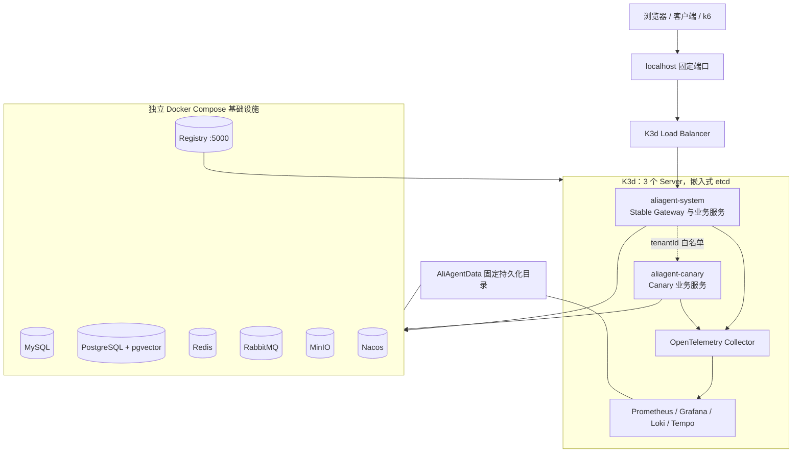
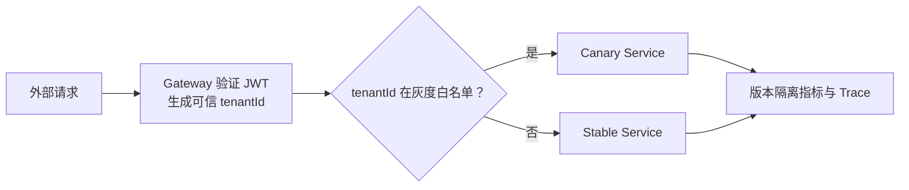
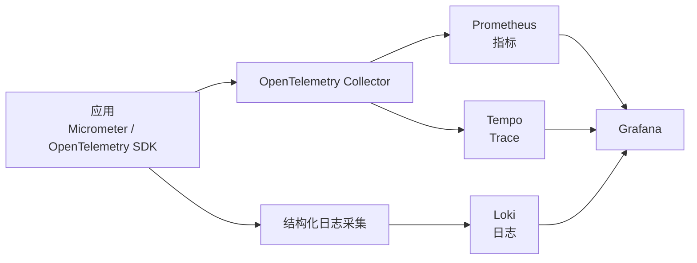

# P10 生产化治理设计

## 1. 文档目标

本文冻结 P10“生产化治理”的范围、部署拓扑、可观测性、租户灰度、安全、备份恢复、容量验证和阶段验收标准。

P10 的目标不是新增业务能力，而是把 P0～P9 已完成的服务和业务链路变成可重复部署、可观测、可灰度、可恢复、可压测并具备生产迁移路径的平台。

P10 阶段出口：

- 三节点 K3s 高可用生产拓扑可通过本地 K3d 环境重复模拟。
- Gateway、业务服务和可观测组件可通过 Helm 安装、升级、回退和销毁。
- 指标、日志和 Trace 能通过统一追踪字段关联，关键故障能够告警。
- 可按可信 `tenantId` 将指定租户路由到 Canary，并可立即回退 Stable。
- 跨租户、密钥轮换、文件安全、数据删除和高风险操作保护通过验证。
- MySQL、PostgreSQL、MinIO、Nacos 和 Outbox 恢复链路通过演练，满足 `RPO ≤ 15 分钟`、`RTO ≤ 2 小时`。
- k6 性能基线覆盖在线消费者、AI、WebSocket、RAG 和订单查询场景。

## 2. 范围与非目标

### 2.1 P10 范围

1. 本地三节点 K3d/K3s 高可用模拟环境和本地 Docker Registry。
2. 基础设施 Compose 与 Windows 固定目录持久化。
3. 应用镜像、Helm Chart、多环境 Values、健康检查、优雅停机、资源限制、NetworkPolicy 和 HPA。
4. 基于可信租户白名单的 Stable/Canary 灰度及快速回退。
5. OpenTelemetry/Micrometer、Prometheus、Grafana、Loki、Tempo 和告警。
6. Secret 引用、双密钥轮换、跨租户测试、文件安全、数据生命周期与高风险操作保护。
7. MySQL/PostgreSQL PITR、MinIO 版本控制、Nacos 导出、RabbitMQ 定义和 Outbox 重投。
8. k6 冒烟、基线、压力、稳定性和故障场景。
9. 生产验收报告、容量基线、RPO/RTO 证据和运维手册。

### 2.2 P10 非目标

- 不在 P10 新增订单、售后、人工客服、评测或洞察业务功能。
- 不把 MySQL、PostgreSQL、Redis、RabbitMQ、MinIO 或 Nacos 迁入本地 K3d。
- 不在本地环境部署真实公网域名、生产证书或外部 Secret 管理平台。
- 不建设通用发布平台、通用 Service Mesh 或多集群管理平台。
- 不承诺以单台开发机证明物理节点、机房或区域级容灾；本地环境只验证拓扑、流程和配置。
- 不把生产备份用于普通开发测试，不在 Git 中保存真实密钥或持久化数据。

## 3. 方案选择

### 3.1 采用方案：分层生产拓扑

本地以 Docker Desktop 为运行底座：K3d 三个 Server 运行 Gateway、业务服务和完整轻量可观测栈；有状态基础设施由独立 Docker Compose 运行；应用镜像通过 Docker Desktop 中的本地 Registry 分发。

选择原因：

- 三个 K3d Server 可验证嵌入式 etcd、调度、滚动发布和核心服务多副本。
- 基础设施数据与 K3d 生命周期解耦，集群可随时销毁重建。
- 相比全部部署进 K3d，更适合当前 `6 核 12 线程、32 GB` 的开发机。
- Helm Values 可以沿用到测试和正式三节点 K3s 环境，减少本地与生产差异。

### 3.2 未采用方案

**全部部署进 K3d**：更接近纯 Kubernetes，但对本机 CPU、内存和存储压力较大，有状态服务恢复演练也更复杂。

**精简 Kubernetes 模拟**：只运行核心服务会降低资源占用，但无法一次验证完整可观测、告警、灰度、容量和恢复证据。

## 4. 总体架构

### 4.1 主机资源基线

- 开发机：`6 核 12 线程、32 GB RAM`。
- Docker Desktop/WSL2：建议上限 `5 CPU、18 GB 内存、4 GB Swap`。
- Windows、IDE、Maven 和浏览器保留约 `1 个物理核心、14 GB 内存`。
- Kubernetes 工作负载的总内存 Request 目标为 `12～14 GB`，不得以无限制资源运行。
- 完整栈无法在资源上限内稳定运行时，应先缩小副本和保留周期，不能取消资源限制或牺牲主机稳定性。

### 4.2 固定数据目录

本地持久化根目录为：

`D:\Java\code\AliAgent\AliAgentData`

目录约定：

| 子目录 | 用途 |
|---|---|
| `mysql/` | MySQL 数据 |
| `postgres/` | PostgreSQL 数据 |
| `redis/` | Redis 持久化数据 |
| `rabbitmq/` | RabbitMQ 数据 |
| `minio/` | MinIO 对象数据 |
| `nacos/` | Nacos 数据与导出 |
| `backups/` | 本地备份和恢复演练产物 |
| `observability/` | Grafana、Prometheus、Loki、Tempo 持久化数据 |
| `registry/` | Docker Registry 数据 |

整个 `AliAgentData/` 必须被 `.gitignore` 排除。目录初始化脚本只能创建缺失目录，不得清空已有数据。

### 4.3 本地 Registry

- Registry 作为 Docker Desktop 容器运行，Windows 推送地址为 `localhost:5000`。
- K3d 创建时连接 Registry，集群内拉取地址固定为 `aliagent-registry:5000`。
- Registry 数据写入 `AliAgentData\registry`。
- 镜像名称必须包含服务名和不可变版本，例如 `localhost:5000/aliagent/gateway-service:<git-sha>`。
- 生产环境禁止使用 `latest`；正式发布优先固定镜像 Digest。

### 4.4 本地与生产差异

| 能力 | 本地模拟 | 正式生产 |
|---|---|---|
| Kubernetes | K3d，3 个 Server | 3 节点 K3s 高可用 |
| 网络入口 | `localhost` 固定端口、HTTP | Ingress/LB、域名、TLS |
| 镜像仓库 | Docker Desktop Registry | 受控私有 Registry |
| Secret | `.env` 生成 Kubernetes Secret | External Secrets 对接外部密钥系统 |
| 基础设施 | 单机 Compose | 独立高可用或托管基础设施 |
| 备份目的地 | `AliAgentData\backups` | 异机对象存储、不可变保留 |
| 告警通知 | Grafana + 本地 Webhook 日志接收器 | 企业微信、邮件或值班平台 |

本地部署文件必须显式标注模拟边界，不得把单机 Compose 的可用性等同于生产高可用。

## 5. Helm 与服务部署

### 5.1 Chart 结构

P10 使用 Helm 管理部署，至少区分：

- `values-local.yaml`：K3d、本地 Registry、HTTP、较小资源配额。
- `values-test.yaml`：共享测试环境、TLS、测试 Secret 提供者。
- `values-prod.yaml`：三节点 K3s、正式 Registry、External Secrets、生产资源和告警配置。

公共模板负责 Deployment、Service、ConfigMap、Secret 引用、ServiceAccount、NetworkPolicy、PDB、HPA 和迁移 Job。环境差异只通过 Values 或环境专属 Secret 注入，不复制整套清单。

`aliagent-admin` 作为管理端静态站点提供独立镜像和 Helm 部署项，并只通过 Gateway 访问后端。`chat-widget` 继续作为嵌入商城页面的组件包构建产物，不单独部署服务；`widget-playground` 仅用于本地演示 Profile，不进入 Test/Prod 默认拓扑。

### 5.2 命名空间和副本

- `aliagent-system`：Stable Gateway 和业务服务。
- `aliagent-canary`：Canary 版本服务。
- `aliagent-observability`：OTel Collector、Prometheus、Grafana、Loki、Tempo 和告警接收器。

本地默认副本：

| 服务 | 副本 |
|---|---:|
| Gateway | 2 |
| Conversation | 2 |
| AI Orchestration | 2 |
| Knowledge | 1 |
| Evaluation | 1 |
| Insight | 1 |

正式环境的 Gateway、Conversation 和 AI Orchestration 至少 2 副本。核心副本使用软反亲和规则尽量分散到不同节点，并配置 PodDisruptionBudget，避免维护时同时不可用。

P10 必须为根 Maven 聚合中的六个独立服务和 `mall-portal` 提供镜像与 Helm 部署项。`mall-portal` 是订单、物流和售后事实接口的运行入口，本地默认 1 副本，生产至少 2 副本。旧 AliAgent 单体只作为 P3 已冻结回退链路的可选 Profile 部署，不进入默认 Stable 拓扑；`mall-admin`、`mall-search`、`mall-demo` 不属于本阶段默认运行清单，除非后续 ADR 明确引入。

### 5.3 健康检查和优雅停机

- `startupProbe`：允许应用等待配置中心、数据库和依赖初始化。
- `readinessProbe`：只有可以安全接收流量的实例进入 Service Endpoint。
- `livenessProbe`：只检测进程失活或不可恢复卡死，不把短暂下游故障当成重启条件。
- Spring Boot 开启优雅停机，设置明确的 `terminationGracePeriodSeconds`。
- Pod 终止时先使 Readiness 失败并摘除流量，再等待进行中的 HTTP、SSE、WebSocket 和 AI 任务结束。
- RabbitMQ 消费者先停止拉取新消息，再完成或安全拒绝当前消息。
- 无法在宽限期完成的流式生成必须留下可恢复状态，不允许静默丢失。

### 5.4 数据库迁移

- Flyway 使用独立 Helm Hook Job 执行，业务 Deployment 不并发执行迁移。
- 迁移成功后才能升级应用；迁移失败阻止发布。
- Stable 与 Canary 并存期间只允许向前、向后兼容的 Expand/Contract 迁移。
- 删除列、收紧非空约束或改变事件语义等破坏性操作必须延后到旧版本完全退出之后。

### 5.5 资源和弹性

- 所有容器必须配置 CPU、内存 `requests/limits`。
- 本地 HPA 默认不自动扩容，只验证模板和指标读取有效；正式环境按压测证据启用。
- HTTP 服务优先使用 CPU、内存和请求指标；RabbitMQ 消费者可使用队列积压或消费延迟指标。
- AI 并发由应用信号量、租户限流和队列共同保护，HPA 不能替代下游容量控制。

## 6. 租户灰度与回退

### 6.1 灰度规则

- Gateway 必须移除客户端提供的租户、主体、角色和权限内部头，再注入可信上下文。
- 灰度白名单来自动态配置，不要求重新构建镜像。
- Stable 与 Canary 必须遵循相同外部 API 契约；异步兼容通过 `eventVersion` 保证。
- 默认只有测试租户进入 Canary；扩大范围必须有观察窗口和指标证据。
- Prometheus、日志和 Trace 使用低基数的 `deployment.track=stable|canary` 与 `service.version` 区分版本。
- 禁止把原始 `tenantId` 作为 Prometheus 标签。灰度命中可在受控日志中记录租户哈希。

### 6.2 回退

- Canary 错误率、延迟、AI 成本或业务成功率超过门限时，立即清空租户白名单。
- 自动停止灰度的初始规则为：Canary 在连续 5 分钟且至少 100 个请求的窗口内，错误率超过 Stable `2` 个百分点或达到 Stable 的 `2` 倍，或者 P95 延迟超过 Stable `50%`。AI 成本和业务成功率先使用同窗口告警，由发布负责人确认回退；获得稳定基线后再冻结自动阈值。
- 回退流量不依赖回滚数据库；这要求灰度期迁移保持双向兼容。
- 镜像和 Helm Release 保留上一稳定版本，可在流量回退后执行版本回滚。
- Canary 写入的事件和 Outbox 仍按幂等规则处理，不因回退重复产生业务结果。

## 7. 可观测性

### 7.1 数据链路

OTel Collector 是遥测出口，统一处理批量、重试、资源属性和敏感字段过滤。应用不得因 Collector、Prometheus、Loki 或 Tempo 暂时不可用而阻断业务请求。

### 7.2 统一关联字段

- `traceId`、`spanId`、`requestId`
- `serviceName`、`serviceVersion`、`environment`
- `deployment.track`：`stable` 或 `canary`
- `tenantRef`：仅限日志/Trace 中的不可逆哈希或内部短标识
- `conversationRef`、`generationRef`：脱敏后的关联标识

禁止记录 JWT、服务密钥、模型密钥、Prompt 全文、完整订单事实和个人敏感资料。禁止把订单号、会话 ID、用户 ID、租户 ID 等高基数字段作为 Prometheus 标签。

### 7.3 关键 Span

- Gateway 鉴权、可信上下文注入、Stable/Canary 路由。
- Conversation 提交、SSE 推送、WebSocket 连接、断线恢复。
- RabbitMQ 发布、等待、消费、重试和死信。
- Outbox/Inbox、售后 Saga 和补偿。
- 模型调用、排队、首 Token、完整生成和降级。
- RAG 向量召回、关键词召回、融合和重排。
- `mall` 订单、物流、售后等受控工具调用。
- 人工接管、转派、客服公开回复和副驾建议。

Span 属性只记录操作类型、结果、耗时、版本和脱敏引用；正文和业务敏感事实不进入 Span。

### 7.4 指标

| 分类 | 指标 |
|---|---|
| 服务 | QPS、P50/P95/P99、错误率、JVM、线程池、数据库连接池 |
| AI | 排队时间、首 Token、生成耗时、Token 数、估算成本、限流和降级次数 |
| RAG | 向量/关键词召回耗时、融合耗时、重排耗时、Top-K 命中率、空结果率 |
| MQ | 发布失败、队列积压、最老消息、消费延迟、重试、死信、Outbox 未投递 |
| 实时连接 | SSE/WebSocket 在线数、断线率、恢复成功率、消息发送延迟 |
| 业务 | AI 自助解决率、转人工率、售后成功率、补偿次数 |
| 灰度 | Stable/Canary 错误率、延迟、AI 成本和业务成功率对比 |

租户级详细分析继续由脱敏日志和 `insight-service` 提供，不通过 Prometheus 高基数标签实现。

### 7.5 本地保留与资源上限

- Prometheus：7 天。
- Loki：3 天。
- Tempo：3 天。
- Grafana 配置、仪表盘和上述组件的数据写入 `AliAgentData\observability`。
- 每个组件设置磁盘和内存上限；达到容量阈值时先缩短遥测保留或降低采样率，不能挤占数据库持久化空间。
- 正式环境的保留周期由合规、成本和排障需求另行配置，不照搬本地数值。

### 7.6 仪表盘与告警

至少提供：服务总览、AI/RAG、消息可靠性、实时连接、业务指标、Stable/Canary 对比和基础设施容量看板。

初始告警门限：

| 告警 | 初始门限 |
|---|---|
| 普通接口延迟 | P95 连续 5 分钟超过 `500 ms` |
| AI 首 Token | P95 连续 5 分钟超过 `3 s` |
| 服务错误率 | 连续 5 分钟超过 `2%` |
| RabbitMQ 积压 | 超过 `1000` 或最老消息超过 5 分钟 |
| Outbox | 未投递记录持续增长超过 10 分钟 |
| 下游连续失败 | 模型或 `mall` 工具在滚动窗口内达到配置阈值 |
| 数据库连接池 | 使用率超过 `80%` |
| 磁盘 | 使用率超过 `80%` |
| Canary 退化 | 使用第 6.2 节的 5 分钟、100 请求及差值规则，触发停止扩大灰度 |

Canary 告警使用第 6.2 节的最小样本数和相对差值规则，避免低流量误报。告警先进入 Grafana 页面并发送至本地 Webhook 日志接收器；生产 Values 可替换外部通知渠道。

## 8. 安全与隐私治理

### 8.1 网络、身份和运行时

- Gateway 是外部业务流量唯一入口；业务服务和基础设施不直接暴露公网。
- 命名空间采用默认拒绝的 NetworkPolicy，仅开放明确的入口、服务调用、DNS、OTel 和基础设施访问。
- 服务使用独立 ServiceAccount 和最小 RBAC；业务 Pod 默认不需要访问 Kubernetes API。
- 容器默认使用非 Root 用户、只读根文件系统、最小 Linux Capability，并禁止特权模式。
- 镜像固定不可变版本或 Digest；CI 执行依赖、镜像、Secret 泄露和高危漏洞扫描。
- 服务间调用继续使用短期服务 JWT 与用户身份快照，下游同时校验二者。

### 8.2 Secret 和轮换

- 本地真实密钥保存在未提交的 `.env` 中，由受控脚本生成 Kubernetes Secret。
- Helm Values 和 Git 只保存 Secret 键名、引用和示例占位符。
- 正式环境预留 External Secrets 对接接口，Chart 不绑定具体供应商。
- 数据库密码、服务 JWT 和模型密钥采用双密钥过渡：先发布新密钥并允许新旧验证，再切换签发/使用方，最后撤销旧密钥。
- 轮换全过程必须有审计、验证和回退点；旧密钥只保留有限验证窗口。
- 日志、Trace、异常页和健康接口不得输出 Secret 值。

### 8.3 跨租户和数据生命周期

- 对 REST、SSE、WebSocket、MQ、RAG、工具调用、评测和洞察接口执行跨租户拒绝测试。
- 客户端伪造内部租户头、主体头、角色头或 Canary 标识时必须被 Gateway 移除并覆盖。
- 数据删除使用可审计编排任务，覆盖业务表、向量、对象、缓存、匿名派生数据和依法允许删除的备份索引。
- 用户注销和租户删除必须支持失败重试、幂等、进度查询和最终核验。
- 备份介质采用加密和到期清除，删除请求立即阻止目标数据恢复到在线系统；已存在的不可变备份在保留期内通过删除清单进行隔离，恢复后必须在开放流量前重新执行删除任务，保留期结束后物理清除。验收报告必须明确本地模拟的备份保留期和正式合规策略差异。
- 备份按线上数据相同敏感级别保护，不允许复制到普通开发环境。

### 8.4 文件安全

知识上传和其他文件入口必须执行：

1. 文件大小、扩展名、声明 MIME、实际 MIME 和文件魔数白名单校验。
2. 文件名规范化，拒绝路径穿越、双扩展名和危险归档结构。
3. 文件先进入 MinIO 隔离区，不得在扫描前进入解析、向量化或发布流程。
4. 通过可替换的恶意文件扫描器和内容安全检查后，才移动到受信区域。
5. 扫描失败、超时或组件不可用时默认拒绝发布，并记录脱敏审计。

本地可使用轻量扫描实现验证流程；生产可以替换扫描引擎，但隔离、默认拒绝和审计语义保持不变。

### 8.5 高风险操作二次认证

P10 将以下操作认定为必须评估并默认要求 Step-up Authentication 的高风险管理操作：租户全量删除、生产恢复覆盖、密钥轮换最终撤销、扩大 Canary 范围到非测试租户、手工 Outbox 大批量重投和修改备份保留策略。

本地环境可以使用模拟的二次确认凭据验证流程；正式环境应对接身份提供方的 MFA/重新认证能力。仅弹出前端确认框不视为二次认证。所有高风险操作必须记录主体、权限、原因、请求追踪和结果。

## 9. 备份恢复与灾难演练

### 9.1 备份策略

| 组件 | 策略 | 恢复目标 |
|---|---|---|
| MySQL | 周期全量备份 + Binlog 连续保留 | 时间点恢复 |
| PostgreSQL | 基础备份 + WAL 归档 | PITR |
| MinIO | Bucket 版本控制 + 对象清单 + 异机副本 | 指定版本对象恢复 |
| Nacos | 配置、命名空间和必要元数据定期导出 | 重建配置中心 |
| Redis | 只备份无法从事实来源重建的数据 | 恢复必要临时状态 |
| RabbitMQ | 导出定义；业务消息依靠 Outbox/Inbox 重建 | 重建交换机、队列和绑定 |
| Outbox | 受控查询、核验和批量重投工具 | 恢复未完成事件投递 |

本地备份统一写入 `D:\Java\code\AliAgent\AliAgentData\backups`。正式环境将备份复制到异机对象存储，配置加密、保留周期和不可变保护。

为满足 `RPO ≤ 15 分钟`，本地验证基线固定为：MySQL Binlog 和 PostgreSQL WAL 连续归档，归档或上传延迟告警门限为 5 分钟；全量/基础备份每日一次；MinIO 版本变更清单、Nacos 导出和 RabbitMQ 定义每日一次。正式环境可提高频率，但不得低于能够实测满足 15 分钟 RPO 的配置。Redis 中任何无法重建的数据必须进入同一 15 分钟恢复口径，否则不得继续作为仅缓存数据处理。

### 9.2 恢复演练流程

- 恢复脚本必须要求显式目标环境，并拒绝默认指向当前正式实例。
- 恢复环境使用独立网络、端口、数据库名和 `test-restore-` 前缀资源。
- 验证订单、会话、知识、售后 Saga、Outbox/Inbox 与对象引用的一致性。
- 演练完成后清理临时实例、临时数据库和测试资源，保留脱敏报告和校验摘要。
- 每次发布前执行备份可读性检查；定期执行完整恢复演练。

### 9.3 RPO/RTO 口径

- `RPO ≤ 15 分钟`：以故障模拟时间与恢复后最后一个可验证一致业务事实的时间差计算。
- `RTO ≤ 2 小时`：以宣布开始恢复到核心业务冒烟全部通过并允许受控恢复流量的时间计算。
- 不能只以“数据库进程启动”作为 RTO 完成；业务、对象、配置和事件一致性均必须通过。
- 本地演练证明流程和工具满足目标；正式环境仍需在真实基础设施上重新验证。

## 10. 容量与性能验证

### 10.1 工具和数据

使用 k6 覆盖 HTTP、SSE 和 WebSocket。测试资源统一使用 `test-` 或 `rag-test-` 前缀，脚本必须包含清理或输出可执行清理命令。

容量数据集：

- 100～300 个在线消费者。
- 50 个并发 AI 任务。
- 20～50 个客服 WebSocket 长连接。
- 10 万商品的向量召回、全文召回、融合和重排数据。
- 百万级订单的授权查询评估数据。

测试数据必须为合成数据，不依赖真实生产数据。大规模种子数据可通过可重复脚本生成，并记录版本、随机种子和生成参数。

### 10.2 场景分级

| 类型 | 用途 |
|---|---|
| `smoke` | 每个 PR 的小流量基础接口、鉴权和关键链路验证 |
| `baseline` | 阶段集成建立可比较的延迟、吞吐和资源基线 |
| `stress` | 逐步加压，识别容量拐点和保护策略 |
| `soak` | 持续 2～4 小时，观察内存、连接、积压和磁盘增长 |
| `failure` | 模拟模型、数据库、RabbitMQ、Redis 和服务实例故障 |

关键链路覆盖普通问答、RAG、订单工具调用、流式回复、人工接管、转派、消息恢复、重复投递、消费者重启、Outbox 重投和租户灰度。

### 10.3 性能门禁

| 指标 | 门限 |
|---|---:|
| 普通查询 P95 | `< 500 ms` |
| AI 首 Token P95 | `< 3 s` |
| HTTP 请求错误率 | `< 1%` |
| AI 编排任务成功率 | `≥ 99%` |
| SSE/WebSocket 消息恢复成功率 | `≥ 99.9%` |
| 跨租户访问拒绝率 | `100%` |
| 重复消息业务幂等 | 不产生重复业务结果 |
| 滚动发布 | 核心业务持续可用 |

模型耗时受外部供应商影响时，报告必须同时给出端到端首 Token、平台内部排队耗时和模型调用耗时，不能通过排除慢请求伪造达标。

### 10.4 资源保护

- AI 并发通过信号量、队列和租户限流控制。
- 下游调用配置超时、熔断和受控降级；故障时禁止虚构订单、物流、价格、退款和审批事实。
- 达到保护阈值时应排队或明确拒绝，不能无限堆积请求拖垮集群。
- 压测时同时记录 JVM、Pod、节点、连接池、RabbitMQ、首 Token、Token 成本和存储增长。
- Canary 未达到门限时禁止扩大租户白名单。

## 11. 错误处理和操作安全

- 所有部署、备份、恢复、重投和清理脚本默认启用失败即停，并输出明确退出码。
- 破坏性命令必须打印目标环境、集群、命名空间、数据库和目录，并要求显式确认参数。
- 可重试操作必须幂等；不可自动重试的高风险步骤必须给出人工处置和回退说明。
- 遥测后端故障不得阻塞业务；数据库、`mall` 或模型故障必须使用现有受控降级语义。
- Compose、K3d、Helm 和 k6 的失败都要保留可定位日志，但在归档前执行 Secret 和个人信息脱敏。
- 自动清理只处理明确的 `test-`、`rag-test-`、`test-restore-` 资源，禁止模糊匹配生产数据。

## 12. 任务边界与集成顺序

P10 拆为四个隔离任务包。协调会话先冻结目录、端口、Chart 接口、镜像命名、遥测属性、Secret 键名和验收命令，再从同一冻结提交创建独立分支和 Worktree。

### 12.1 P10-A：平台部署与灰度

负责 K3d、Registry、基础设施 Compose、镜像构建、Helm、多环境 Values、健康检查、优雅停机、资源限制、NetworkPolicy、PDB、HPA 和租户灰度。

不得实现可观测仪表盘、备份工具或 k6 业务场景。

### 12.2 P10-B：可观测与告警

负责应用遥测接入、OTel Collector、Prometheus、Grafana、Loki、Tempo、仪表盘、告警规则和本地 Webhook 日志接收器。

与 P10-A 只通过冻结的 Helm 子 Chart、ServiceMonitor/遥测端口和资源属性接口协作。

### 12.3 P10-C：安全与恢复

负责 Secret 生成与轮换流程、跨租户安全套件、文件安全、数据删除核验、备份、PITR、MinIO/Nacos/RabbitMQ 恢复、Outbox 重投和 RPO/RTO 演练。

不得改写业务事实规则；恢复工具只调用各事实服务和数据库已冻结的受控接口。

### 12.4 P10-D：容量与验收

负责 k6 数据生成、smoke/baseline/stress/soak/failure 场景、阈值门禁、容量报告和 P10 最终验收编排。

P10-D 消费 A/B/C 提供的稳定接口和运维命令，不在压测任务内修补各服务实现。

### 12.5 依赖与并行关系

- A、B、C 可在契约冻结后并行开发。
- B 依赖 A 冻结 Helm 扩展点和遥测端口，但不依赖 A 全部完成。
- D 可先开发脚本框架和数据生成器，完整验收必须等待 A、B、C 集成完成。
- 集成顺序固定为 A → B → C → D；冲突和公共文件只由集成会话处理。

## 13. 验证策略

### 13.1 每个任务 PR

- Maven/前端编译和所属模块测试。
- Helm `lint`、模板渲染和 Values Schema 校验。
- Dockerfile 构建及容器非 Root 检查。
- YAML、Shell/PowerShell、k6 和配置静态检查。
- Secret 泄露、依赖和镜像高危漏洞扫描。
- `git diff --check`，并确认未提交 `.env`、`AliAgentData/` 或测试产物。

### 13.2 P10 集成验证

1. 从干净状态创建 Registry、基础设施 Compose 和三节点 K3d。
2. 构建镜像并推送 Registry。
3. Helm 执行迁移并部署 Stable。
4. 验证服务注册、健康检查、优雅停机和滚动发布。
5. 验证指标、日志、Trace 的关联和敏感字段过滤。
6. 验证告警和本地 Webhook。
7. 部署 Canary，为测试租户配置白名单并执行回退。
8. 执行跨租户、文件安全、密钥轮换、数据删除和高风险操作测试。
9. 执行 k6 基线、压力、稳定性和故障测试。
10. 执行备份恢复演练并记录实际 RPO/RTO。
11. 清理所有测试数据和临时恢复实例，确认持久化目录未被误删。
12. 销毁并重建 K3d，证明基础设施数据和 Registry 不受影响。

## 14. 最终验收证据

P10 验收报告至少包含：

- Git 提交、镜像版本/Digest、Helm Release 和 Values 摘要。
- 三节点状态、Pod 分布、健康检查、滚动发布和回退记录。
- Grafana 看板截图或导出、告警触发与恢复证据。
- 一个完整 `traceId` 关联 Gateway、MQ、AI、RAG/工具和流式链路的证据。
- Stable/Canary 租户路由、指标对比和一键回退证据。
- 跨租户、文件安全、Secret 轮换、数据删除和高风险操作测试报告。
- k6 场景参数、结果、容量拐点、资源峰值和性能门禁结论。
- 备份清单、恢复步骤、一致性校验以及实际 RPO/RTO。
- 已知容量上限、生产差异、风险、回退方式和后续改进清单。

只有所有必需证据可重复生成，且测试资源已清理，P10 才能标记完成。

## 15. 已冻结决策

- 正式目标为 3 节点 K3s 高可用，使用嵌入式 etcd。
- 本地使用 Docker Desktop + K3d 三个 Server，Server 同时承担控制面和业务负载。
- 有状态基础设施由独立 Docker Compose 运行，不部署进 K3d。
- 数据根目录为 `D:\Java\code\AliAgent\AliAgentData`。
- 本地 Registry 运行在 Docker Desktop，外部地址 `localhost:5000`，集群内地址 `aliagent-registry:5000`。
- 使用 Helm，区分 Local、Test、Prod Values。
- 本地使用 `.env`/Kubernetes Secret，生产预留 External Secrets。
- 灰度按 Gateway 可信 `tenantId` 白名单路由。
- 使用 Prometheus、Grafana、Loki、Tempo 和 OpenTelemetry Collector 完整轻量栈。
- 本地告警使用 Grafana + Webhook 日志接收器。
- 本地备份写入 `AliAgentData\backups`，生产复制到异机对象存储。
- 使用 k6 进行 HTTP、SSE、WebSocket 和故障压测。
- 本机 Docker Desktop 建议配置为 `5 CPU、18 GB 内存、4 GB Swap`。
- P10 拆为 A 部署灰度、B 可观测告警、C 安全恢复、D 容量验收四个任务包。
