# 电商 AI 客服与运营协同平台分阶段实施计划

> 文档版本：1.0
> 计划状态：待执行
> 编制日期：2026-07-12
> 架构依据：`docs/电商AI客服平台-总体架构设计.md`

---

## 1. 实施目标

本计划用于将现有 AliAgent 渐进式迁移为电商 AI 客服与运营协同平台，并接入 `macrozheng/mall` 作为商品、订单、库存、物流、售后和退款的模拟电商中台。

实施不限制总周期，但必须遵守以下原则：

1. 现有 AliAgent 在迁移期间保持可运行。
2. 采用纵向业务切片交付，不同时铺开所有功能。
3. 每个阶段必须具备明确输入、产出、测试和退出条件。
4. 新旧实现并存时使用开关切流，验证稳定后再删除旧实现。
5. 第一条完整闭环为“订单售后闭环”。
6. 五个 AI 服务从第一天建立边界，但优先完整实现会话、编排和知识服务。

## 2. 阶段总览

```mermaid
flowchart LR
    P0["Phase 0 决策固化"]
    P1["Phase 1 工程与基础设施"]
    P2["Phase 2 mall 接入基线"]
    P3["Phase 3 Knowledge 拆分"]
    P4["Phase 4 Conversation 拆分"]
    P5["Phase 5 AI Orchestration 拆分"]
    P6["Phase 6 订单售后闭环"]
    P7["Phase 7 人工客服与副驾"]
    P8["Phase 8 持续评测"]
    P9["Phase 9 运营洞察"]
    P10["Phase 10 生产化治理"]

    P0 --> P1 --> P2 --> P3 --> P4 --> P5 --> P6 --> P7 --> P8 --> P9 --> P10
```



| Phase | 主题 | 核心结果 |
|---|---|---|
| 0 | 决策固化与基线 | 架构、范围、ADR 和验收口径统一 |
| 1 | 工程与基础设施 | 单仓库、多服务骨架和本地环境可启动 |
| 2 | `mall` 接入基线 | Git Subtree、JWT、内部 API、Outbox 可用 |
| 3 | 知识服务拆分 | 现有 RAG 迁入独立 `knowledge-service` |
| 4 | 会话服务拆分 | 消息、SSE/WebSocket、人工状态归会话服务 |
| 5 | AI 编排拆分 | 意图路由、状态机、工具治理归编排服务 |
| 6 | 订单售后闭环 | 查询、确认、审批、取消和模拟退款全链路 |
| 7 | 人工客服与副驾 | 技能组分配、人工接管和 AI 辅助回复 |
| 8 | 持续评测 | 线上反馈、评测集、离线回放和发布门禁 |
| 9 | 运营洞察 | 基础指标、投诉主题和运营问题雷达 |
| 10 | 生产化治理 | 可观测、Kubernetes、灰度、备份与容量验证 |

## 3. 统一完成定义

每个阶段只有同时满足以下条件才能标记完成：

- 代码已合并且编译通过
- 数据库迁移可从空库执行
- 自动化测试通过
- OpenAPI/AsyncAPI 契约同步更新
- Docker Compose 环境可验证
- 日志包含 `traceId`、`tenantId`、`requestId`
- 新增数据具备租户隔离
- 新增写操作具备鉴权、幂等和审计
- 失败路径和降级行为已验证
- 测试数据按 `test-` 或 `rag-test-` 命名并清理
- 文档和开发命令同步更新

## 4. Phase 0：架构基线与迁移准备

### 4.1 目标

将讨论结果转为可执行的工程约束，建立迁移前基线，避免后续服务拆分过程中反复改变边界。

### 4.2 任务

- [ ] 审核并确认总体架构设计文档
- [ ] 建立 ADR 目录，记录关键架构决策
- [ ] 记录现有 AliAgent API、数据库表和主要链路基线
- [ ] 补充现有系统冒烟测试
- [ ] 记录当前响应时间、RAG 命中和模型调用成本基线
- [ ] 定义统一 ID、时间、错误码、分页和事件信封规范
- [ ] 定义 `tenantId`、`traceId`、`requestId` 传播规范
- [ ] 确定 AI 微服务兼容的 Spring Boot / Spring Cloud Alibaba / Spring AI Alibaba 版本矩阵
- [ ] 定义迁移期间的功能开关和回退策略

### 4.3 交付物

- `docs/adr/` 架构决策记录
- 现有 API 与表结构清单
- 冒烟测试脚本或测试类
- 技术版本兼容矩阵
- 新旧链路切换清单

### 4.4 验收标准

- 现有 AliAgent 后端和前端可正常启动
- 登录、聊天、会话管理、知识上传和 RAG 问答冒烟测试通过
- 后续每个领域的数据归属和服务归属不存在未决项

## 5. Phase 1：单仓库工程与基础设施

### 5.1 目标

搭建目标目录、服务骨架、契约目录和本地基础设施。此阶段不迁移核心业务逻辑。

### 5.2 目标目录

```text
AliAgent/
├── services/
│   ├── gateway-service/
│   ├── conversation-service/
│   ├── ai-orchestration-service/
│   ├── knowledge-service/
│   ├── evaluation-service/
│   └── insight-service/
├── mall/
├── frontend/
│   ├── apps/
│   └── packages/
├── contracts/
├── deploy/
├── docs/
└── pom.xml
```

### 5.3 任务

- [ ] 将根工程改为 Maven 聚合工程
- [ ] 创建六个 Spring Boot 服务骨架
- [ ] 创建前端 pnpm Monorepo
- [ ] 建立 OpenAPI、AsyncAPI 和 JSON Schema 目录
- [ ] 创建 Docker Compose 基础环境：MySQL、PostgreSQL、Redis、RabbitMQ、Nacos、MinIO
- [ ] 创建五个 PostgreSQL 数据库和独立账号
- [ ] 为每个服务接入 Flyway
- [ ] 接入 Spring Boot Actuator 健康检查
- [ ] 建立统一日志字段和请求上下文组件
- [ ] 建立短期服务 JWT 的最小实现
- [ ] 建立 CI 基础任务：编译、单测、契约校验、前端构建
- [ ] 为 `evaluation-service` 和 `insight-service` 建立事件接收骨架

### 5.4 暂不实现

- 不迁移现有聊天和 RAG 逻辑
- 不实现售后业务
- 不实现 Kubernetes 部署
- 不实现完整可观测平台

### 5.5 验收标准

- `docker compose up` 可启动全部基础设施
- 六个服务可注册到 Nacos并通过健康检查
- 每个服务只能连接自己的数据库
- Gateway 可路由到空服务健康接口
- 服务 JWT 校验能拒绝未授权内部调用
- 契约校验任务在 CI 中运行

## 6. Phase 2：mall 接入与电商中台基线

### 6.1 目标

通过 Git Subtree 引入 `mall`，保持其模块化单体和 MySQL 基线，建立 AI 平台所需的身份、查询和事件接口。

### 6.2 任务

- [ ] 使用 Git Subtree 将 `macrozheng/mall` 引入 `mall/`
- [ ] 记录上游版本、远端地址和后续同步命令
- [ ] 完成 `mall` 最小启动环境
- [ ] 保留会员与后台员工两套账号体系
- [ ] 为 MEMBER/STAFF 统一签发短期 JWT
- [ ] JWT 加入 `tenantId`、角色、权限摘要和主体类型
- [ ] 新增 AI 内部只读 API：
  - [ ] 查询商品
  - [ ] 查询订单
  - [ ] 查询物流
  - [ ] 查询库存
  - [ ] 查询售后资格
- [ ] 建立 OpenAPI 契约
- [ ] 新增 `outbox_event` 及投递任务
- [ ] 发布商品、订单、物流等基础事件
- [ ] 增加 `tenantId` 兼容方案和默认测试租户
- [ ] 建立 Mock 物流适配接口和轨迹数据

### 6.3 安全要求

- 内部 API 同时验证服务身份和用户身份
- 订单接口必须校验会员归属或员工数据范围
- Gateway 删除客户端伪造的内部身份头
- 敏感字段默认脱敏

### 6.4 验收标准

- 消费者登录后可获得 MEMBER JWT
- 客服登录后可获得 STAFF JWT
- Gateway 可验证两种 JWT
- 通过内部 API 可正确查询测试订单和物流
- 查询他人订单返回拒绝
- 商品变更能够可靠生成并投递 Outbox 事件

## 7. Phase 3：knowledge-service 拆分

### 7.1 目标

将现有 AliAgent 文档上传、切片、Embedding、pgvector 和检索能力迁移到独立知识服务，同时保持旧接口可回退。

### 7.2 任务

- [ ] 将文档、分块、向量表迁移到 `knowledge_db`
- [ ] 迁移文档摄入、Tika 解析和 TokenTextSplitter
- [ ] 迁移 DashScope Embedding 适配器
- [ ] 建立 `knowledge-api` 与 `knowledge-worker` Profile
- [ ] 文档上传改为 MinIO 存储
- [ ] 通过 RabbitMQ 创建摄入任务
- [ ] 实现商品只读视图及商品事件幂等消费
- [ ] 实现关键词检索
- [ ] 实现 pgvector 语义检索
- [ ] 实现 RRF 融合
- [ ] 抽象 `Reranker`，第一阶段提供可替换实现
- [ ] 增加 `tenantId`、知识域、版本和权限过滤
- [ ] 建立知识版本与审核状态
- [ ] 提供检索 OpenAPI
- [ ] 为旧 AliAgent 增加远程知识服务适配器和开关

### 7.3 数据迁移策略

- 旧文档和分块数据先复制到新库
- 校验文档数、切片数和向量维度
- 双跑检索结果并比较 Top-K
- 切换读取后观察一段时间
- 稳定后停止旧库写入

### 7.4 验收标准

- 文档上传后异步解析并可查看状态
- 未发布知识不参与在线检索
- 发布后能通过关键词和向量混合检索命中
- 商品事件能更新只读视图和商品知识
- 跨租户检索被拒绝
- 旧 AliAgent 可通过远程接口完成 RAG 问答

## 8. Phase 4：conversation-service 拆分

### 8.1 目标

将会话、消息、实时推送和人工客服状态从现有单体抽离。

### 8.2 任务

- [ ] 设计会话、消息、消息序号和参与者模型
- [ ] 迁移现有会话和消息数据
- [ ] 支持 AI、用户、客服、内部备注等消息类型
- [ ] REST 提交消息和查询历史
- [ ] SSE 推送 AI 片段与工具进度
- [ ] WebSocket 推送人工消息、排队和接管状态
- [ ] Redis 保存连接实例归属
- [ ] Redis Pub/Sub 实例定向转发
- [ ] Redis 缓冲 AI 草稿并定期检查点到 PostgreSQL
- [ ] 支持断线按消息序号补拉
- [ ] 支持取消生成、重复提交幂等
- [ ] 建立会话摘要和有限上下文快照
- [ ] 建立短期与受控长期偏好模型
- [ ] 发布 `AIReplyRequested` 事件
- [ ] 现有 AliAgent 前端切换到新会话接口

### 8.3 验收标准

- 消息先落库再发布 AI 任务
- 两个会话服务实例下仍能正确推送消息
- SSE 断线后可以恢复当前草稿和最终消息
- 重复发送同一个 `requestId` 不产生重复用户消息
- 服务重启后生成中消息标记为中断或可恢复
- 跨租户消息访问被拒绝

## 9. Phase 5：ai-orchestration-service 拆分

### 9.1 目标

将现有 Agent、RAG 编排和模型调用迁移到独立 AI 编排服务，建立固定工作流、工具治理和版本化发布能力。

### 9.2 任务

- [ ] 消费 `AIReplyRequested`
- [ ] 接收有限上下文快照
- [ ] 实现意图路由
- [ ] 建立商品、订单、物流、售后、转人工和普通问答流程骨架
- [ ] 建立 PostgreSQL 持久化状态机
- [ ] 建立工具注册中心
- [ ] 为 `mall` 查询工具生成 OpenFeign 客户端
- [ ] 为 `knowledge-service` 生成检索客户端
- [ ] 通过 WebClient 向会话服务传输流式片段
- [ ] 实现工具权限、参数 Schema、超时、脱敏和审计
- [ ] 建立 ChatModelPort 和 DashScope/Mock 适配器
- [ ] 建立 Prompt、工作流和模型版本表
- [ ] 实现租户配额、并发和场景优先级
- [ ] 接入 Sentinel 限流、熔断和降级
- [ ] 发布完成、失败和转人工事件

### 9.3 验收标准

- 普通问答、RAG 问答、订单查询走不同工作流
- 编排服务重启后可恢复等待用户输入的流程
- RabbitMQ 重复投递不重复调用写工具
- 模型不可用时正确引导转人工
- `mall` 不可用时禁止生成订单和退款事实
- 每次任务完整记录模型、Prompt、工作流、知识和规则版本

## 10. Phase 6：订单售后纵向闭环

### 10.1 目标

跑通第一条完整业务闭环：订单/物流查询 → 售后意图 → 风险分级 → 确认 → 审批 → 取消或模拟退款 → 结果通知。

### 10.2 mall 改造

- [ ] 新增售后申请、退款单、审批记录和操作申请表
- [ ] 建立固定安全规则骨架
- [ ] 建立版本化策略规则表
- [ ] 实现规则草稿、审核、发布、租户灰度和回滚
- [ ] 实现规则热更新快照
- [ ] Nacos 增加写操作紧急熔断开关
- [ ] 实现三级风险判断
- [ ] 实现未发货订单取消
- [ ] 实现创建售后申请
- [ ] 实现退款申请和客服/主管审批
- [ ] 实现模拟退款异步回调
- [ ] 实现库存、优惠券和积分回滚
- [ ] 建立退款 Saga、幂等和定时对账

### 10.3 AI 平台改造

- [ ] 售后多轮信息收集流程
- [ ] 订单和物流实时工具
- [ ] 售后规则 RAG 检索
- [ ] 风险判断工具
- [ ] 服务端确认卡
- [ ] 用户确认与操作过期
- [ ] AliAgent 管理端客服和主管审批页面
- [ ] 结果事件通知消费者
- [ ] 全链路操作审计

### 10.4 核心场景

- [ ] 未发货订单取消：用户确认后自动执行
- [ ] 已收货退款：进入客服审批
- [ ] 高金额仅退款：客服初审 + 主管审批
- [ ] 退款渠道失败：可重试或人工处理
- [ ] 退款成功但权益恢复失败：继续补偿直至完成
- [ ] 重复确认：只执行一次
- [ ] 规则版本切换：旧申请继续使用原版本

### 10.5 验收标准

- 第一条纵向闭环端到端测试通过
- 关键状态可在 `mall` 中追溯
- AliAgent 不保存审批最终事实
- 任何执行结果都有实时业务依据
- `mall`、MQ 或模型故障时不存在错误承诺和重复退款

## 11. Phase 7：人工客服与 AI 副驾

### 11.1 目标

建立从 AI 服务到人工接管，再到 AI 客服副驾的完整协作链路。

### 11.2 任务

- [ ] 客服在线状态与接待容量
- [ ] 技能组、技能标签和数据范围
- [ ] AI 生成路由标签
- [ ] 规则化技能组路由与负载分配
- [ ] VIP、高金额和高风险优先级
- [ ] 超时重分配与主管升级
- [ ] 客服接管、拒绝、转派和结束
- [ ] AI 转为副驾，禁止直接回复消费者
- [ ] 回复建议、规则依据和订单摘要
- [ ] 敏感承诺和情绪升级提醒
- [ ] 会话结束摘要、标签和内部备注
- [ ] 客服修改建议的差异记录
- [ ] 满意度收集

### 11.3 验收标准

- 转人工后 AI 不再公开发言
- 会话可按技能组正确分配
- 客服接管后消费者实时收到消息
- 客服修改 AI 建议后可形成评测候选样本
- 客服离线时可创建待处理工单

## 12. Phase 8：evaluation-service 持续评测

### 12.1 目标

形成线上反馈到离线回归再到版本发布门禁的闭环。

### 12.2 任务

- [ ] 消费会话完成、用户反馈、客服修改和工具失败事件
- [ ] 匿名化和敏感字段清理
- [ ] 评测候选样本审核
- [ ] 评测集与版本管理
- [ ] Mock 模型离线回放
- [ ] 真实 DashScope 专用回归任务
- [ ] 意图、工具、RAG、事实、风险和转人工指标
- [ ] Prompt/工作流/模型/知识版本对比
- [ ] 发布门槛与阻断规则
- [ ] 评测结果页面

### 12.3 验收标准

- 线上错误样本可进入评测集
- 同一评测集可比较两个版本
- 发布门禁能阻止明显退化版本
- 评测样本不包含可识别个人敏感信息

## 13. Phase 9：insight-service 运营洞察

### 13.1 目标

将业务事件和会话事件转化为可解释的运营指标与问题雷达。

### 13.2 任务

- [ ] 消费订单、退款、售后、库存和会话事件
- [ ] 建立脱敏事实表和按日聚合表
- [ ] 退款率、退款金额和原因分布
- [ ] 转人工率、客服响应和满意度
- [ ] 商品、类目和物流问题聚合
- [ ] 投诉主题聚类
- [ ] 知识缺口发现
- [ ] 运营自然语言查询
- [ ] 涉及明细和金额时调用 `mall` 二次核验
- [ ] 运营问题雷达页面

### 13.3 验收标准

- 可回答“本周退款率上升的主要原因”
- 可关联受影响商品、类目和会话主题
- 分析库不保存完整订单和敏感消费者资料
- 聚合结果可回溯到事件版本和统计周期

## 14. Phase 10：生产化治理

### 14.1 可观测性

- [ ] 接入 OpenTelemetry/Micrometer
- [ ] 部署 Prometheus、Grafana、Loki、Tempo
- [ ] 覆盖 Gateway、RabbitMQ、模型、RAG、工具和实时连接 Span
- [ ] 建立服务、AI 成本、消息积压和业务指标看板
- [ ] 建立异常告警

### 14.2 Kubernetes

- [ ] 为每个服务提供镜像
- [ ] Deployment、Service、ConfigMap、Secret
- [ ] 健康检查和优雅停机
- [ ] NetworkPolicy
- [ ] HPA 或基于队列指标扩容
- [ ] Helm 或标准 YAML
- [ ] 按租户灰度路由

### 14.3 安全与隐私

- [ ] 跨租户渗透与自动化测试
- [ ] 文件类型、病毒和内容安全检查
- [ ] 数据生命周期清理任务
- [ ] 用户注销和租户删除编排
- [ ] 服务密钥轮换
- [ ] 高风险操作二次认证评估

### 14.4 备份恢复

- [ ] MySQL 与 PostgreSQL 时间点恢复
- [ ] MinIO 版本控制和异地备份
- [ ] Nacos 配置导出
- [ ] Outbox 事件重投工具
- [ ] 恢复演练并验证 `RPO ≤ 15分钟`、`RTO ≤ 2小时`

### 14.5 容量和性能

- [ ] 100～300 在线用户压测
- [ ] 50 并发 AI 任务压测
- [ ] 20～50 客服 WebSocket 压测
- [ ] 10 万商品混合检索压测
- [ ] 百万级订单查询接口评估
- [ ] AI 首 Token 小于 3 秒
- [ ] 普通查询 P95 小于 500 毫秒

## 15. 跨阶段工程要求

### 15.1 契约管理

- HTTP 先改 OpenAPI，再实现服务
- 事件先改 AsyncAPI/JSON Schema，再发布生产者
- 破坏性变更必须新增版本
- 消费者先兼容新旧版本，再升级生产者

### 15.2 消息治理

- 事件必须有 `eventId`、`eventVersion`、`tenantId`、`traceId`
- 生产端 Outbox、消费端 Inbox
- 写操作消息禁止无幂等处理
- 死信必须可查看、可重投和可审计

### 15.3 多租户

- 所有表和缓存键都必须评审 `tenantId`
- 所有 RabbitMQ 消费者必须恢复租户上下文
- 所有向量查询必须带租户过滤
- 所有 MinIO 对象键必须带租户路径

### 15.4 AI 安全

- 外部内容一律视为不可信输入
- 工具参数必须使用 Schema 校验
- 模型不能绕过规则和权限
- 写操作必须经过确认或审批
- 无实时依据时拒绝生成关键事实

## 16. 推荐的首批 ADR

| ADR | 主题 |
|---|---|
| ADR-001 | `mall` 作为业务事实来源，AI 禁止直连其数据库 |
| ADR-002 | 五个 AI 核心服务立即拆分 |
| ADR-003 | RabbitMQ Outbox/Inbox 与 Saga 最终一致性 |
| ADR-004 | REST + SSE + WebSocket 混合实时通信 |
| ADR-005 | PostgreSQL + pgvector 混合 RAG |
| ADR-006 | 轻量三级风险与审批状态机 |
| ADR-007 | JWT、服务 JWT 与全链路租户隔离 |
| ADR-008 | Prompt、规则和知识版本化发布 |
| ADR-009 | 前端 Monorepo 与 chat-widget 嵌入方式 |
| ADR-010 | Docker Compose 开发、Kubernetes 生产目标 |

## 17. 第一里程碑建议

第一里程碑不是完成全部微服务，而是达到以下状态：

```text
Gateway + Nacos + RabbitMQ + PostgreSQL + MySQL 可启动
→ mall 可签发统一 JWT
→ conversation-service 可保存消息
→ ai-orchestration-service 可消费任务
→ knowledge-service 可返回检索结果
→ mall 可返回测试订单与物流
→ 消费者能收到带订单事实和知识依据的 AI 回答
```

这一里程碑完成后，再进入具有写操作的订单取消和退款审批，避免在基础链路尚未稳定时引入资金状态复杂度。

## 18. 最终完成标志

平台达到以下条件时，可认为总体架构目标完成：

- 三端产品闭环可用：消费者、客服、运营
- 五个 AI 服务和 `mall` 边界稳定
- 订单售后、人工客服、持续评测和运营洞察均可运行
- 关键写操作具备确认、审批、幂等、审计和补偿
- RAG 具备版本、引用、混合检索和低置信拒答
- 支持单租户落地并通过跨租户隔离测试
- Docker Compose 与 Kubernetes 部署均可用
- 可观测性、备份恢复和容量目标通过验证
- 现有 AliAgent 单体中的旧实现已安全退役
