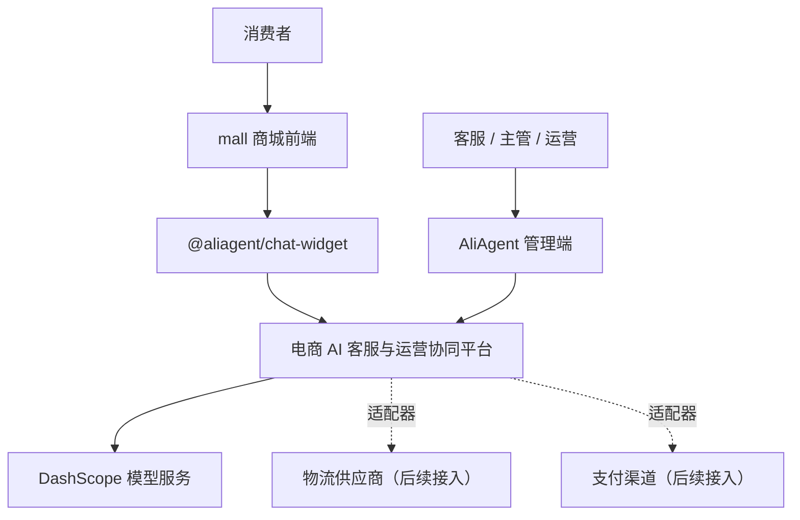
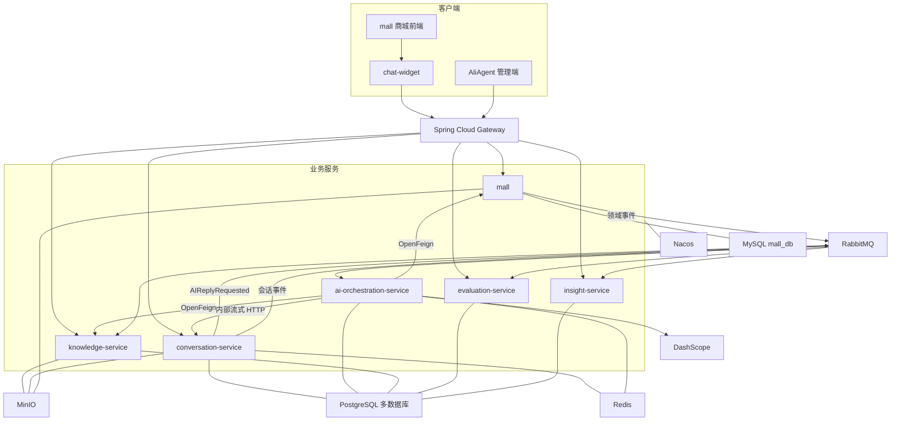
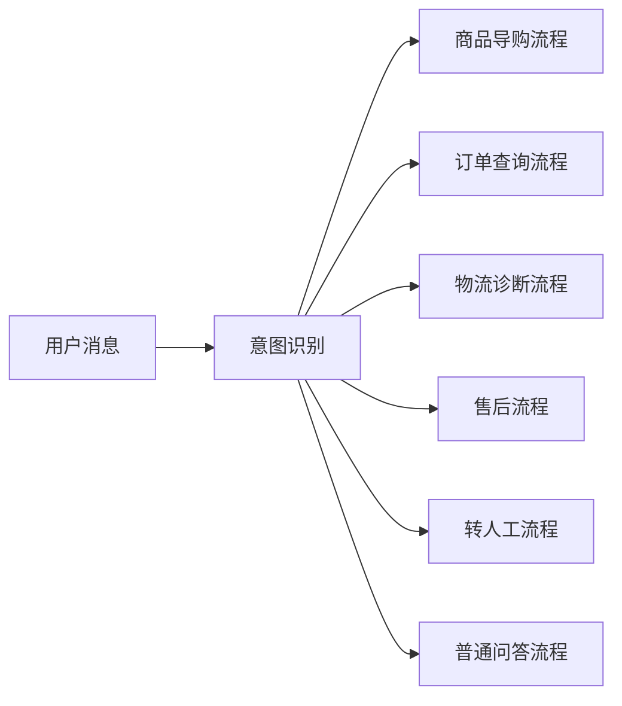
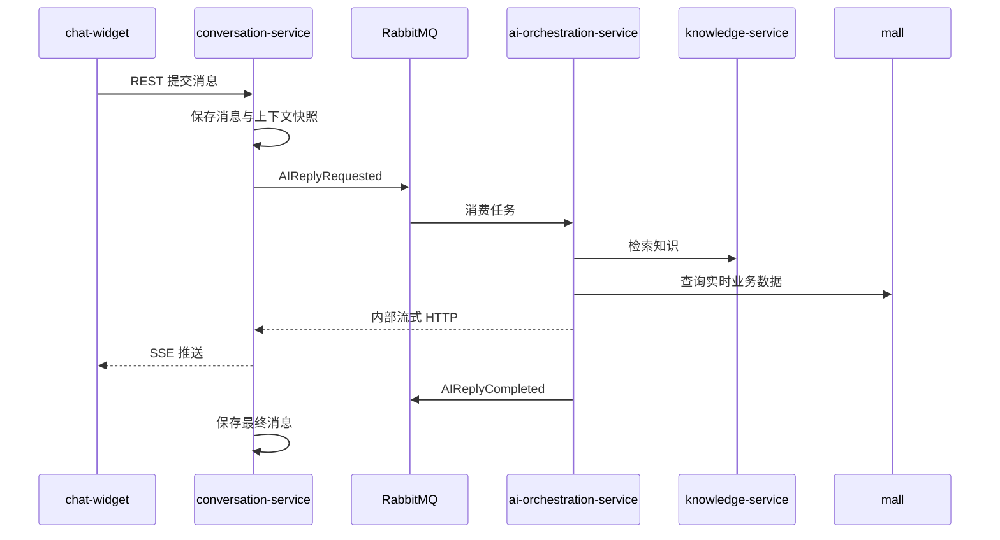

# 电商 AI 客服与运营协同平台总体架构设计

> 文档版本：1.0
> 架构状态：已确认
> 编制日期：2026-07-12
> 适用项目：AliAgent + macrozheng/mall

---

## 1. 文档目的

本文档固化 AliAgent 从通用 AI 对话应用演进为电商 AI 客服与运营协同平台的总体架构，作为后续代码拆分、接口设计、数据库建模、部署、测试和验收的统一依据。

平台面向拥有平台店铺、私域商城或独立站的中小电商商家，使用 `mall` 作为商品、订单、库存、物流、售后和退款的模拟电商中台，AliAgent 负责 AI 对话、知识检索、人工客服协同、持续评测和运营洞察。

## 2. 产品定位

平台定位为：

> 面向电商平台的、具备业务工具调用、RAG 依据追溯、人工确认与持续评测能力的智能客服与运营协同平台。

### 2.1 目标用户

| 用户 | 使用入口 | 核心诉求 |
|---|---|---|
| 消费者 | `mall` 商城内嵌聊天组件 | 商品咨询、订单查询、物流查询、售后申请、转人工 |
| 客服人员 | AliAgent 管理端 | 人工接管、AI 回复建议、订单摘要、售后初审 |
| 客服主管 | AliAgent 管理端 | 高风险审批、规则审核、队列与服务质量管理 |
| 运营人员 | AliAgent 管理端 | 知识治理、AI 评测、投诉分析、运营问题发现 |
| 系统管理员 | `mall` 与 AliAgent 管理端 | 租户、员工、角色、权限、配置与审计管理 |

### 2.2 核心业务能力

- AI 商品导购与商品对比
- 订单、物流、库存和优惠资格实时查询
- 售后意图识别、材料收集和风险分级
- 用户确认卡、客服审批和主管审批
- 人工客服排队、技能组分配和 AI 客服副驾
- 商品知识、售后规则和客服 SOP 的 RAG 检索与引用
- 线上反馈、离线回放和 AI 版本评测
- 投诉主题、退款原因和客服效率的运营洞察

## 3. 架构原则

1. **业务事实归属明确**：商品、订单、物流、售后、审批和退款事实只归 `mall` 所有。
2. **AI 不直接操作数据库**：AI 服务只能通过受控业务工具调用 `mall` API。
3. **关键事实必须有依据**：订单、物流、价格、库存、政策和执行结果禁止由模型推测。
4. **高风险操作分级控制**：模型负责理解，规则负责判断，用户负责确认，人工负责例外审批。
5. **服务独立演进**：各服务独立数据库、独立构建、独立镜像和独立部署。
6. **异步优先、最终一致**：跨服务业务使用 Outbox、RabbitMQ、幂等消费和 Saga 状态机。
7. **租户全链路隔离**：HTTP、数据库、缓存、消息、文件和向量检索都必须携带可信 `tenantId`。
8. **版本化治理**：规则、Prompt、工作流、模型参数和知识内容均支持审核、灰度和回滚。
9. **可观测、可评测、可恢复**：所有关键调用可追踪，AI 效果可回归，系统故障可降级和恢复。

## 4. 系统上下文



## 5. 总体逻辑架构

### 5.1 服务划分

平台采用单仓库、多应用架构，后端包含 Gateway、五个 AI 核心服务和 `mall` 模块化单体。

| 应用 | 主要职责 | 数据库 |
|---|---|---|
| `gateway-service` | 路由、JWT 验证、服务鉴权、租户上下文、限流、审计 | 无业务数据库 |
| `conversation-service` | 会话、消息、SSE/WebSocket、人工客服、队列、分配、记忆 | `conversation_db` |
| `ai-orchestration-service` | 意图路由、持久化状态机、工具注册、模型调用、确认卡 | `orchestration_db` |
| `knowledge-service` | 商品只读视图、知识摄入、混合检索、重排、知识版本 | `knowledge_db` + pgvector |
| `evaluation-service` | 反馈、评测集、离线回放、版本对比 | `evaluation_db` |
| `insight-service` | 事件事实、指标聚合、运营洞察 | `insight_db` |
| `mall` | 认证、商品、订单、库存、物流、售后、规则、审批、退款 | MySQL `mall_db` |

### 5.2 架构图



## 6. 服务职责与边界

### 6.1 gateway-service

负责所有外部流量的统一入口：

- 验证 `mall` 签发的短期 JWT
- 清除客户端伪造的内部身份头
- 生成可信的用户、角色、租户和链路上下文
- 校验基础权限、限流和请求大小
- 路由 REST、SSE 和 WebSocket 请求
- 生成并传递 `traceId`、`requestId`
- 验证短期服务 JWT
- 记录基础访问审计

Gateway 不负责数据聚合、业务规则和退款审批。

### 6.2 conversation-service

拥有会话域全部事实：

- 会话与消息持久化
- AI、人工、内部备注等消息类型
- SSE 与 WebSocket 连接管理
- 消息序号、断线补拉和重复提交防护
- 客服在线状态、技能组队列、自动分配和转派
- AI 服务、等待人工、人工服务等会话状态
- 会话摘要、短期上下文和用户确认偏好
- 客服副驾建议的展示与采纳记录
- 满意度和反馈事件发布

不保存订单、退款或审批事实。

### 6.3 ai-orchestration-service

拥有 AI 推理和工作流执行状态：

- 意图识别与页面上下文解析
- 导购、订单、物流、售后、转人工等固定工作流
- PostgreSQL 持久化轻量状态机
- Prompt、工作流、模型参数版本管理
- 模型适配器和调用治理
- 工具注册中心、权限过滤、参数校验和结果脱敏
- RAG 与业务实时数据组合
- 确认卡生成和 `actionId` 关联
- Token、并发、成本和租户配额控制
- 工具调用、模型调用和依据审计

不直接写入 `mall` 数据库，也不保存审批最终事实。

### 6.4 knowledge-service

拥有知识与商品检索域：

- 文档元数据、版本、切片和向量
- 商品、类目和非实时属性的只读视图
- 文档上传、解析、切片、Embedding 和索引更新
- 关键词 + pgvector 混合召回
- RRF 融合、可插拔重排和低置信拒答
- 知识草稿、审核、发布、灰度、回滚和下线
- 知识版本、权限和租户过滤
- RAG 引用的文档版本和切片 ID 返回

同一套代码采用两种运行角色：

- `knowledge-api`：在线查询与管理 API
- `knowledge-worker`：解析、向量化和索引重建

### 6.5 evaluation-service

- 接收用户评价、客服修改、转人工原因和工具失败事件
- 建立匿名化评测样本
- 管理评测集、评测任务和结果
- 对 Prompt、工作流、模型和知识版本做离线回放
- 输出意图准确率、工具准确率、引用正确率、幻觉率等指标
- 为 AI 版本发布提供门禁结果

### 6.6 insight-service

- 消费订单、退款、售后、库存和会话事件
- 保存脱敏事实和聚合指标，不复制完整订单
- 计算退款率、转人工率、客服效率和满意度
- 聚类投诉主题与退款原因
- 生成商品、物流、页面描述和知识缺口问题雷达
- 具体订单或实时金额需要通过 `mall` API 二次核验

### 6.7 mall

`mall` 保持模块化单体和原生 MySQL 技术基线，负责：

- 会员账号和后台员工账号
- 统一 JWT 签发
- 商品、类目、价格、库存和订单
- 模拟物流轨迹与物流适配接口
- 售后申请、退款单、审批记录和业务状态机
- 固定安全规则与版本化策略规则
- 模拟退款执行、异步回调和权益回滚
- Outbox 事件发布
- 高风险操作的资源权限和业务状态二次校验

## 7. 前端架构

前端采用 Monorepo：

```text
frontend/
├── apps/
│   ├── aliagent-admin/
│   └── widget-playground/
├── packages/
│   ├── chat-widget/
│   ├── api-client/
│   ├── ui/
│   └── shared/
└── pnpm-workspace.yaml
```

### 7.1 chat-widget

作为 Vue 组件包嵌入 `mall-app-web`，支持：

- 创建、恢复和关闭会话
- REST 提交消息
- SSE 接收 AI 流式回答和工具进度
- WebSocket 接收人工客服消息和队列状态
- 商品卡、订单卡、物流卡、引用卡和确认卡
- 附件上传、满意度、断线重连与消息补拉

前端传入的 `productId`、`orderId` 仅作为上下文线索，后端必须验证资源归属。

### 7.2 aliagent-admin

包含：

- 客服工作台
- 客服队列与技能组
- 主管审批列表
- 知识管理与审核发布
- Prompt、工作流和模型版本管理
- 评测集、回放和版本对比
- 运营指标与问题雷达
- 死信队列、同步状态和审计查询

第一阶段由前端通过 Gateway 并行调用 2～3 个领域服务，不新增 BFF。

## 8. 身份、权限与租户隔离

### 8.1 身份体系

`mall` 保留两套账号体系，但统一 JWT 契约：

- `MEMBER`：消费者会员
- `STAFF`：客服、主管、运营、管理员

JWT 最小声明示例：

```json
{
  "sub": "10001",
  "subjectType": "STAFF",
  "tenantId": "tenant-001",
  "roles": ["CUSTOMER_SERVICE"],
  "permissions": ["conversation:takeover", "aftersale:review"]
}
```

### 8.2 权限模型

后台采用 RBAC + 数据范围：

- 权限点控制具体操作
- 数据范围控制店铺、技能组、商品类目和会话
- Gateway 校验入口权限
- 各服务校验资源级权限
- 退款审批、规则发布等关键权限实时向 `mall` 核验

### 8.3 服务身份

- 服务间调用使用短期服务 JWT
- JWT 包含调用方、目标服务、权限范围和有效期
- 下游同时校验服务身份和用户身份快照
- Kubernetes NetworkPolicy 限制通信关系
- 外部流量禁止绕过 Gateway 访问内部接口

### 8.4 多租户隔离

- Gateway 从可信 JWT 注入 `tenantId`
- 服务入口建立 `TenantContext`
- MyBatis-Plus 自动追加租户条件
- 表、索引、缓存键、对象路径、消息和向量元数据包含 `tenantId`
- 后台任务必须显式指定租户
- 关键 PostgreSQL 数据可增加行级安全策略
- 自动化测试覆盖跨租户读写、检索和附件访问

第一阶段只运行一个模拟租户，但从数据和接口层完整支持多租户。

## 9. 数据架构

### 9.1 数据库归属

```text
MySQL
└── mall_db

PostgreSQL
├── conversation_db
├── orchestration_db
├── knowledge_db（pgvector）
├── evaluation_db
└── insight_db
```

各服务使用独立数据库账号，禁止跨库查询。

### 9.2 数据同步策略

采用混合数据模式：

- 商品、类目、商品说明、FAQ 和规则说明通过事件同步
- 订单、物流、库存、价格和优惠资格实时调用 `mall`
- AliAgent 的商品数据仅为只读检索视图
- `mall` 始终是业务事实来源

### 9.3 数据库迁移

- 每个服务独立使用 Flyway
- 已发布迁移脚本禁止修改
- 使用“扩展—迁移—收缩”保证滚动发布兼容
- CI 验证全新建库和历史版本升级

### 9.4 文件存储

所有非结构化文件存入 MinIO：

```text
knowledge/tenant-{id}/
conversation/tenant-{id}/
aftersale/tenant-{id}/
```

业务服务只保存对象键和元数据，通过短期签名 URL 访问。

## 10. AI 编排架构

### 10.1 编排模式

采用“意图路由 + 固定工作流 + 专业能力模块”，不使用完全自治的多 Agent 网络。



### 10.2 持久化状态机

`orchestration_db` 保存多轮工作流状态：

```text
CREATED
→ ROUTING
→ RUNNING
→ WAITING_USER_INPUT
→ WAITING_CONFIRMATION
→ COMPLETED

异常：RETRY_PENDING / FAILED / CANCELLED
```

Redis 只保存执行锁、取消标记和热点状态。

### 10.3 工具治理

每个工具必须注册元数据：

- 工具名称和领域
- READ/WRITE 类型
- 允许角色与场景
- 参数和结果 Schema
- 风险等级与确认要求
- 超时、重试和幂等要求
- 结果脱敏和审计级别

模型每次只获得当前用户和工作流允许使用的工具子集。

### 10.4 模型适配

第一阶段默认使用 DashScope，但通过端口适配：

```text
ChatModelPort
├── DashScopeChatAdapter
├── OpenAICompatibleAdapter
└── MockChatAdapter

EmbeddingModelPort
├── DashScopeEmbeddingAdapter
└── MockEmbeddingAdapter
```

暂不增加独立模型网关。

## 11. RAG 与知识治理

### 11.1 分层知识

| 数据类型 | 获取方式 |
|---|---|
| 商品名称、品牌、类目、规格 | 结构化查询 |
| 实时价格、库存 | `mall` 实时 API |
| 商品卖点、说明、FAQ | 商品知识库 |
| 退换货、配送、优惠规则 | 规则知识库 |
| 客服 SOP、优秀案例 | 客服知识库 |

### 11.2 检索链路

```text
查询理解与上下文补全
→ 知识域和权限过滤
→ 关键词召回 + pgvector 召回
→ RRF 融合
→ 可插拔 Reranker
→ 去重与上下文构建
→ 带引用生成
→ 依据一致性检查
```

低于置信阈值时拒绝伪造依据。

### 11.3 知识发布

```text
DRAFT → PROCESSING → READY_FOR_REVIEW → PUBLISHED → RETIRED
```

- 在线检索只使用 `PUBLISHED` 版本
- 敏感政策和 SOP 必须人工审核
- 支持按租户灰度、定时生效和回滚
- 回答记录知识版本和切片 ID

## 12. 售后、审批与退款架构

### 12.1 职责分工

- AI：识别意图、提取参数、收集材料、解释结果
- `mall` 规则：判断资格、风险等级和审批路径
- 用户：通过确认卡确认真实意图
- 客服/主管：处理中高风险例外
- `mall`：保存审批事实并执行取消、退款和权益回滚

### 12.2 三级风险

| 风险 | 处理方式 | 示例 |
|---|---|---|
| 低风险 | 用户确认后自动执行 | 未发货且符合规则的取消 |
| 中风险 | 客服审批 | 部分退款、补发、换货 |
| 高风险 | 客服初审 + 主管审批 | 高金额仅退款、超期退款 |

### 12.3 确认卡

确认卡由服务端生成，包含：

- 操作对象和操作类型
- 金额、当前状态和业务影响
- 规则判断依据
- 执行结果说明
- 一次性 `actionId`
- 有效期和幂等键

执行前 `mall` 必须再次检查订单和规则状态。

### 12.4 规则治理

- 不可变安全规则写在 Java 代码中
- 可调策略存入 `mall` MySQL 版本化规则表
- 状态为草稿、待审核、已发布、已停用
- 发布后通过 Outbox + RabbitMQ 热更新规则快照
- Nacos 仅保存运行参数、功能开关和紧急熔断
- 规则按租户灰度，不按请求比例随机分流

### 12.5 模拟退款

第一阶段不接真实支付渠道，但真实维护：

- 退款单及处理中、成功、失败状态
- 订单和售后状态
- 模拟异步退款回调
- 库存、优惠券和积分回滚
- 幂等和对账

## 13. 消息与一致性架构

### 13.1 可靠消息

- 生产端使用 Outbox
- 消费端使用 Inbox/消费记录幂等
- 指数退避重试
- 多次失败进入死信队列
- 管理端支持死信查看和人工重投
- 在线 AI、商品同步、评测、分析使用独立队列

统一事件信封：

```json
{
  "eventId": "evt-001",
  "eventType": "ProductUpdated",
  "eventVersion": 1,
  "occurredAt": "2026-07-12T10:00:00Z",
  "tenantId": "tenant-001",
  "traceId": "trace-001",
  "producer": "mall",
  "payload": {}
}
```

### 13.2 Saga 与最终一致性

- 每个服务只保证本地事务
- `mall` 是售后和退款 Saga 的协调者与事实来源
- 补偿基于业务语义，不使用数据库级反向回滚
- 定时对账检查卡住、遗漏和状态不一致流程
- 不引入 Seata

## 14. 实时通信架构

### 14.1 外部通信

| 通道 | 用途 |
|---|---|
| REST | 提交消息、确认卡、审批、历史查询 |
| SSE | AI 流式回答、工具进度、引用结果 |
| WebSocket | 人工客服消息、排队、接管和在线状态 |

### 14.2 AI 请求链路



### 14.3 多实例连接路由

- Redis 保存 `userId/conversationId → instanceId`
- Redis Pub/Sub 负责实例定向通知
- PostgreSQL 保存最终消息
- Redis 缓冲生成内容并定期写 PostgreSQL 草稿
- 客户端断线后按消息序号补拉

## 15. 人工客服架构

### 15.1 技能组分配

AI 生成意图、类目、风险和情绪标签，系统按确定性规则完成：

- 技能组路由
- 在线状态检查
- 当前接待量分配
- VIP、高金额和高风险优先级
- 超时重分配或升级主管

### 15.2 AI 客服副驾

人工接管后：

- AI 禁止直接回复消费者
- 私下生成回复建议
- 展示订单、物流、规则和会话摘要
- 提醒敏感承诺、情绪升级和风险操作
- 生成内部备注、标签和结束摘要
- 客服修改内容进入评测闭环

## 16. 持续评测与版本发布

### 16.1 评测闭环

```text
线上会话
→ 用户评价 / 客服修改 / 转人工原因 / 工具失败
→ 匿名化候选样本
→ 人工筛选进入评测集
→ 新版本离线回放
→ 达标后灰度发布
```

### 16.2 核心指标

- 意图识别准确率
- 工具选择与参数准确率
- RAG 命中率和引用正确率
- 事实一致性和幻觉率
- 风险分级准确率
- 转人工准确率
- 客服采纳率
- 首 Token 延迟、总耗时和模型成本

### 16.3 AI 版本发布

Prompt、工作流和模型参数状态：

```text
DRAFT → TESTING → APPROVED → PUBLISHED → RETIRED
```

每次任务记录：

- `promptVersion`
- `workflowVersion`
- `modelId`
- `knowledgeVersion`
- `ruleVersion`

支持按租户灰度和快速回滚。

## 17. 可观测性与服务治理

### 17.1 技术方案

- Micrometer/OpenTelemetry：指标和链路
- Prometheus + Grafana：监控看板
- Loki：集中日志
- Tempo：分布式链路追踪
- Sentinel：限流、并发限制、熔断和降级

### 17.2 关键指标

- 请求成功率与 P95/P99
- AI 首 Token 延迟
- 模型 Token、费用和并发
- 工具成功率和超时率
- RAG 检索耗时、命中和拒答率
- RabbitMQ 队列积压和死信数
- WebSocket 连接数和重连率
- 转人工率、客服响应时长和满意度

### 17.3 降级策略

| 故障 | 降级行为 |
|---|---|
| 模型不可用 | 停止 AI 生成，保留人工客服与历史消息 |
| 知识服务不可用 | 保留订单物流查询，停止政策和知识回答 |
| `mall` 不可用 | 保留普通问答，禁止订单、退款和库存承诺 |
| RabbitMQ 积压 | 优先在线售后，暂停评测、向量化和分析 |
| Redis 不可用 | 停止新流式任务与人工实时会话，保留历史查询 |
| 客服离线 | 创建待处理工单并告知预计响应时间 |

## 18. 配额与成本治理

- 每租户配置请求次数、Token 和最大并发
- 在线消费者与高风险售后优先于评测和运营分析
- Redis 保存实时配额和并发信号量
- PostgreSQL 保存最终用量和审计
- 超额后限流、降级模型或关闭非必要能力
- 第一阶段只统计和治理，不做商业计费

## 19. 隐私与数据生命周期

| 数据 | 默认策略 |
|---|---|
| 普通会话正文 | 默认保留 180 天，租户在安全范围内可配置 |
| AI 流式缓冲 | 完成后清理，异常草稿短期保留 |
| 工具参数与结果 | 敏感字段脱敏后保留 |
| 高风险操作审计 | 保留 1～3 年 |
| 售后凭证 | 由 `mall` 按售后周期管理 |
| 评测样本 | 匿名化后保存 |
| 运营洞察 | 优先保存聚合结果 |

用户注销和租户删除必须触发跨服务清理任务并记录结果。

## 20. 部署与发布

### 20.1 开发与演示

使用 Docker Compose 启动：

- MySQL
- PostgreSQL
- Redis
- RabbitMQ
- Nacos
- MinIO
- 五个 AI 服务、Gateway 和 `mall`
- 可观测性组件可按 Profile 选择启动

### 20.2 生产目标

使用 Kubernetes：

- 独立 Deployment 与 Service
- 健康检查和优雅停机
- 无状态水平扩容
- NetworkPolicy
- Secret 管理敏感配置
- Helm 或 Kubernetes YAML

### 20.3 发布策略

- 普通服务：滚动发布
- AI 编排：按租户灰度
- Prompt、工作流、模型：独立版本灰度
- 退款规则：按租户绑定版本
- 数据库：先扩展迁移，后应用发布，再收缩
- SSE/WebSocket：实例优雅下线

## 21. 契约与代码仓库

### 21.1 契约管理

```text
contracts/
├── openapi/
│   ├── mall-internal-api.yaml
│   ├── conversation-api.yaml
│   ├── orchestration-api.yaml
│   └── knowledge-api.yaml
└── asyncapi/
    ├── ai-events.yaml
    ├── commerce-events.yaml
    └── evaluation-events.yaml
```

- HTTP 使用 OpenAPI
- RabbitMQ 事件使用 AsyncAPI/JSON Schema
- CI 检查破坏性变更
- 禁止通过共享业务 DTO 形成源码耦合

### 21.2 目标目录

```text
ecommerce-ai-platform/
├── pom.xml
├── services/
│   ├── gateway-service/
│   ├── conversation-service/
│   ├── ai-orchestration-service/
│   ├── knowledge-service/
│   ├── evaluation-service/
│   └── insight-service/
├── mall/
├── frontend/
├── contracts/
├── deploy/
└── docs/
```

`mall` 使用 Git Subtree 纳入主仓库。根 Maven 工程只聚合构建，不强行覆盖 `mall` 的依赖基线。

## 22. 测试策略

- 单元测试：规则、状态机、权限、路由、幂等
- Testcontainers：PostgreSQL、Redis、RabbitMQ 集成测试
- 契约测试：OpenAPI 与 AsyncAPI 兼容性
- WireMock：模拟 `mall`、模型和下游服务
- 端到端测试：订单取消、退款审批、人工接管
- AI 回归：固定数据集验证意图、工具、RAG 和风险分级
- 普通 CI 使用 Mock 模型，专用 AI 回归任务调用真实模型

## 23. 非功能目标

按中小商家生产级设计：

| 指标 | 目标 |
|---|---|
| 注册用户 | 1～10 万 |
| 同时在线 | 100～300 |
| AI 并发任务 | 50 |
| 在线客服 | 20～50 |
| 商品规模 | 10 万 |
| 订单规模 | 百万级 |
| AI 首 Token | 小于 3 秒 |
| 普通查询 P95 | 小于 500 毫秒 |
| 核心服务可用性 | 99.9% |
| 数据恢复点 RPO | 不超过 15 分钟 |
| 恢复时间 RTO | 不超过 2 小时 |

## 24. 关键风险与约束

| 风险 | 控制措施 |
|---|---|
| 服务数量多导致联调困难 | 单仓库、契约优先、Docker Compose、纵向切片交付 |
| AI 幻觉影响业务 | 场景分级依据、实时工具、低置信拒答、人工确认 |
| 消息重复或丢失 | Outbox、Inbox、幂等、重试、死信和对账 |
| 多租户数据泄露 | 全链路 `tenantId`、拦截器、RLS 兜底和安全测试 |
| 规则热更新引发资金风险 | 版本化、审核、租户灰度、紧急熔断和回滚 |
| 实时连接多实例路由 | Redis 连接注册、定向频道、草稿缓冲和消息补拉 |
| 模型成本失控 | 租户配额、优先级、并发控制和成本统计 |
| `mall` 上游升级冲突 | Git Subtree、最小侵入改造、契约隔离 |

## 25. 架构决策结论

本架构采用“`mall` 稳定业务中台 + AliAgent 微服务 AI 平台”的组合。复杂度集中在真正需要独立扩容和治理的会话、AI 编排、知识、评测和洞察领域；订单、库存、售后和资金规则继续由 `mall` 统一控制。

系统以订单售后闭环作为第一条纵向切片，随后扩展商品导购、人工客服副驾、持续评测和运营洞察。实施过程不限制总周期，但每个阶段必须具备独立可运行、可验证、可回滚的交付结果。
