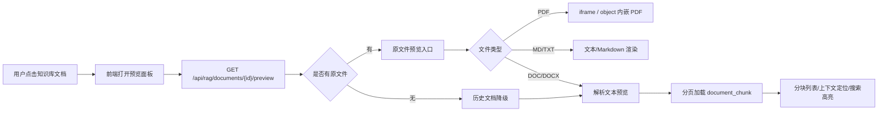

# 知识库文件预览设计方案

> 适用项目：AliAgent  
> 当前技术栈：Spring Boot 3.4.5、MyBatis-Plus、PostgreSQL + pgvector、Vue 3 + TypeScript + Vite  
> 设计目标：在现有 RAG 知识库能力上，新增文档预览、分块查看、来源定位能力。

---

## 1. 背景与现状

当前知识库链路已经完成：

1. 前端上传 PDF / DOCX / MD / TXT 文件。
2. 后端 `DocumentIngestService` 使用 Tika 解析文本。
3. `TokenTextSplitter` 分块。
4. DashScope Embedding 向量化。
5. 写入 `document` 元信息表和 `document_chunk` 分块向量表。
6. 对话时从向量库检索分块，并在回答下方展示来源卡片。

当前缺口：

- 知识库列表只能展示文档名称、大小、类型、分块数，不能打开查看。
- `document` 表只存元信息，未保存原文件路径。
- `document_chunk` 表有解析文本，但没有分页接口和预览交互。
- RAG 来源卡片只能展开片段内容，不能跳转到文档上下文。
- PDF / DOCX 等文件无法进行“原文预览”或“解析文本预览”的切换。

结论：预览功能应分两层建设：

- 第一层：基于已入库的 `document_chunk.content` 做“解析文本 + 分块定位”预览，最快落地。
- 第二层：上传时持久化原文件，支持 PDF 原文件内嵌预览、下载，以及 DOCX/TXT/MD 的增强预览。

---

## 2. 设计目标

### 2.1 功能目标

1. 在知识库抽屉中点击文档，可打开预览面板。
2. 支持查看文档基础信息：名称、类型、大小、上传时间、分块数。
3. 支持查看解析后的文本内容。
4. 支持按分块查看文档内容，并展示分块序号、页码、章节信息。
5. 支持从 RAG 来源卡片跳转到对应文档和分块位置。
6. 对已上传但未保存原文件的历史文档，仍可基于分块文本预览。
7. 对新上传文档，保存原文件，PDF 可直接使用浏览器内嵌预览。
8. 支持文档内关键词搜索，高亮命中内容。

### 2.2 非目标

第一版不做以下能力：

- 在线编辑知识库文档。
- 文档版本管理。
- OCR 扫描件识别。
- PDF 页缩略图、批注、划线标注。
- DOCX 高保真排版还原。
- 多人协作评论。

这些能力可以作为后续增强，不影响当前预览核心链路。

---

## 3. 总体方案

推荐采用“渐进式预览架构”：



核心思想：

- 不依赖浏览器对所有文件的原生预览能力。
- 先保证所有支持类型都能看到“被 RAG 实际使用的解析文本”。
- PDF 原文件预览作为体验增强。
- 分块预览是 RAG 可解释性的关键，因为它展示模型真正检索和使用的内容。

---

## 4. 用户体验设计

### 4.1 入口设计

知识库抽屉中的每个文档条目增加预览入口：

- 点击文档条目：打开预览。
- 删除按钮仍独立存在，点击时阻止冒泡。
- 文档条目 hover 时展示预览态。

建议将当前 `KnowledgeBase.vue` 从 420px 右侧抽屉升级为更宽的管理面板：

- 桌面端：宽度 `min(920px, 92vw)`，左侧列表 320px，右侧预览区自适应。
- 移动端：全屏抽屉，列表和预览使用顶部返回切换。

### 4.2 预览面板结构

```text
┌──────────────────────────────────────────────────────────────┐
│ 知识库                                                       │
├───────────────────────┬──────────────────────────────────────┤
│ 上传区                │ 文档名称.pdf                         │
│                       │ PDF · 2.4 MB · 32 分块 · 今天        │
│ 文档列表              │ [原文] [解析文本] [分块]              │
│ ┌───────────────────┐ │                                      │
│ │ xxx.pdf           │ │ 搜索框                               │
│ │ 2.4 MB · 32 分块  │ │                                      │
│ └───────────────────┘ │ 预览内容区域                         │
│ ┌───────────────────┐ │                                      │
│ │ policy.md         │ │                                      │
│ └───────────────────┘ │                                      │
└───────────────────────┴──────────────────────────────────────┘
```

### 4.3 Tab 设计

预览区建议包含 3 个 Tab：

| Tab | 用途 | 支持类型 |
|---|---|---|
| 原文 | 展示原始文件，PDF 使用浏览器内嵌预览，TXT/MD 直接文本展示 | PDF、TXT、MD；DOCX 降级 |
| 解析文本 | 展示 Tika 解析后被用于 RAG 的文本 | 全部类型 |
| 分块 | 展示入库分块，支持定位到 chunk | 全部类型 |

默认 Tab 规则：

- PDF 且存在原文件：默认打开“原文”。
- MD/TXT：默认打开“解析文本”或“原文”，两者内容基本一致。
- DOC/DOCX：默认打开“解析文本”。
- 历史文档无原文件：默认打开“分块”。

### 4.4 来源卡片跳转

现有 `RAGSourceCard.vue` 建议增加“查看原文”按钮：

1. 点击后打开知识库预览面板。
2. 自动选中文档。
3. 切换到“分块”或“解析文本”Tab。
4. 滚动并高亮对应 `chunkId`。

交互路径：

```text
回答来源卡片 → 查看原文 → KnowledgeBase 打开 → 选中文档 → 高亮 chunk
```

### 4.5 搜索与高亮

第一版推荐做前端本地高亮：

- 在已加载的解析文本或分块中搜索。
- 命中项使用 `<mark>` 高亮。
- 分块 Tab 中只展示命中分块，或保留全部分块并突出命中。

大文档后续可改成后端分页搜索：

```http
GET /api/rag/documents/{id}/chunks?keyword=退款&page=1&pageSize=20
```

---

## 5. 文件类型支持策略

| 类型 | 第一版预览方式 | 增强方向 |
|---|---|---|
| PDF | 有原文件时 iframe 内嵌预览；无原文件时分块文本预览 | 页码定位、缩略图、PDF.js |
| DOCX | Tika 解析文本预览 + 分块预览 | 服务端转 HTML 或 PDF |
| DOC | 后端当前允许，但前端未允许；建议统一为解析文本预览 | 考虑是否继续支持老格式 |
| MD | Markdown 渲染 + 解析文本 + 分块 | 目录提取、标题定位 |
| TXT | 等宽文本预览 + 分块 | 编码检测 |

建议同步调整前后端支持范围：

- 如果继续支持 `.doc`，前端上传 accept 和校验也应加入 `.doc`。
- 如果不打算支持 `.doc`，后端 `ALLOWED_EXTENSIONS` 中也应移除，避免前后端不一致。

---

## 6. 数据库设计

### 6.1 第一版推荐改动

当前 `document` 表只存元信息，建议增加原文件存储相关字段：

```sql
ALTER TABLE document
    ADD COLUMN IF NOT EXISTS content_type VARCHAR(120),
    ADD COLUMN IF NOT EXISTS storage_path VARCHAR(1000),
    ADD COLUMN IF NOT EXISTS checksum VARCHAR(64),
    ADD COLUMN IF NOT EXISTS preview_status VARCHAR(20) DEFAULT 'ready',
    ADD COLUMN IF NOT EXISTS preview_error TEXT,
    ADD COLUMN IF NOT EXISTS updated_at TIMESTAMP DEFAULT CURRENT_TIMESTAMP;

CREATE INDEX IF NOT EXISTS idx_document_checksum ON document(checksum);
CREATE INDEX IF NOT EXISTS idx_document_preview_status ON document(preview_status);
```

字段说明：

| 字段 | 类型 | 说明 |
|---|---|---|
| content_type | VARCHAR(120) | 上传文件 MIME 类型 |
| storage_path | VARCHAR(1000) | 原文件相对存储路径 |
| checksum | VARCHAR(64) | SHA-256，用于去重和完整性校验 |
| preview_status | VARCHAR(20) | ready / failed / missing_file |
| preview_error | TEXT | 预览解析失败原因 |
| updated_at | TIMESTAMP | 文档元信息更新时间 |

历史文档处理：

- 历史数据的 `storage_path` 为空。
- 预览接口发现无原文件时，返回 `hasOriginalFile=false`。
- 前端自动降级到分块预览。

### 6.2 暂不新增 preview_text 字段

不建议第一版把全文直接塞进 `document.preview_text`：

- 大文档会导致 `document` 行过大。
- 现有 `document_chunk` 已经存了 RAG 实际使用文本。
- 分页加载 chunk 更适合预览和搜索。

### 6.3 第二版可选表：document_preview_page

如果后续要做 PDF 页级定位、OCR、缩略图，可新增页面级预览表：

```sql
CREATE TABLE IF NOT EXISTS document_preview_page (
    id VARCHAR(36) PRIMARY KEY,
    document_id VARCHAR(36) NOT NULL REFERENCES document(id) ON DELETE CASCADE,
    page_number INTEGER NOT NULL,
    content TEXT,
    image_path VARCHAR(1000),
    metadata JSONB DEFAULT '{}',
    created_at TIMESTAMP DEFAULT CURRENT_TIMESTAMP
);

CREATE INDEX IF NOT EXISTS idx_preview_page_document_id
    ON document_preview_page(document_id, page_number);
```

第一版不需要这张表，避免过早复杂化。

---

## 7. 后端设计

### 7.1 新增配置

在 `application.yaml` 中增加：

```yaml
aliagent:
  rag:
    storage:
      root: data/rag-files
      max-file-size: 50MB
      allowed-extensions: pdf,doc,docx,md,txt
      inline-preview-types: pdf,txt,md
```

建议新增配置类：

```text
src/main/java/com/bn/aliagent/config/RagStorageProperties.java
```

职责：

- 读取根目录。
- 读取最大文件大小。
- 读取允许的扩展名。
- 初始化存储目录。

### 7.2 原文件存储服务

新增：

```text
src/main/java/com/bn/aliagent/rag/storage/DocumentFileStorageService.java
```

核心职责：

1. 保存上传文件到本地目录。
2. 生成安全文件名。
3. 计算 SHA-256。
4. 根据文档读取原文件 Resource。
5. 删除文档时清理原文件。
6. 防止路径穿越。

推荐存储结构：

```text
data/rag-files/
  2026/
    06/
      19/
        {documentId}.pdf
        {documentId}.docx
```

注意：

- 数据库存相对路径，不存绝对路径。
- 读取时必须 `root.resolve(relativePath).normalize()`。
- 校验最终路径必须仍在 root 下。

### 7.3 摄入流程调整

当前流程：

```text
MultipartFile → Tika 解析 → 分块 → 向量化 → 入库
```

调整后：

```text
MultipartFile
  → 校验扩展名、大小、MIME
  → 生成 documentId
  → 保存原文件到本地
  → 使用保存后的 FileSystemResource 做 Tika 解析
  → 分块
  → 向量化
  → 写入 document，包含 storage_path / content_type / checksum
  → 写入 document_chunk
```

失败补偿：

- 如果保存文件成功，但数据库事务失败，需要删除本地文件。
- 如果解析失败，`document` 不入库，文件也删除。
- 如果后续想保留失败记录，可让 `preview_status=failed`，但第一版建议失败就整体回滚。

### 7.4 预览服务

新增：

```text
src/main/java/com/bn/aliagent/rag/preview/DocumentPreviewService.java
```

核心方法：

```java
DocumentPreviewResponse getPreview(String documentId, String activeChunkId);
ChunkPageResponse listChunks(String documentId, int page, int pageSize, String keyword);
Resource getOriginalFile(String documentId);
```

服务职责：

- 查询文档详情。
- 判断是否有原文件。
- 判断是否支持原文内嵌预览。
- 查询分块列表，必须排除 `embedding` 字段。
- 根据 `chunkId` 找到对应分块和相邻上下文。
- 返回前端需要的预览元数据。

### 7.5 Mapper 调整

当前 `DocumentChunkMapper.findByDocumentId` 使用 `SELECT *`，预览接口应避免取 `embedding` 字段。

建议新增专用查询：

```java
@Select("""
    SELECT id, document_id, content, section_title, page_number,
           chunk_index, metadata, created_at
    FROM document_chunk
    WHERE document_id = #{documentId}
    ORDER BY chunk_index ASC
    LIMIT #{limit} OFFSET #{offset}
    """)
List<DocumentChunk> findPreviewChunks(
    @Param("documentId") String documentId,
    @Param("limit") int limit,
    @Param("offset") int offset
);
```

关键词搜索：

```java
@Select("""
    SELECT id, document_id, content, section_title, page_number,
           chunk_index, metadata, created_at
    FROM document_chunk
    WHERE document_id = #{documentId}
      AND (#{keyword} IS NULL OR content ILIKE CONCAT('%', #{keyword}, '%'))
    ORDER BY chunk_index ASC
    LIMIT #{limit} OFFSET #{offset}
    """)
List<DocumentChunk> searchPreviewChunks(...);
```

### 7.6 Controller 接口设计

建议继续挂在 `/api/rag` 下，保持 Token 鉴权一致。

#### 7.6.1 获取文档详情

```http
GET /api/rag/documents/{id}
```

响应：

```json
{
  "id": "doc-id",
  "name": "退款政策.pdf",
  "type": "pdf",
  "size": 245760,
  "contentType": "application/pdf",
  "chunkCount": 12,
  "hasOriginalFile": true,
  "supportsInlinePreview": true,
  "createdAt": "2026-06-19T10:00:00"
}
```

#### 7.6.2 获取预览元信息

```http
GET /api/rag/documents/{id}/preview?activeChunkId={chunkId}
```

响应：

```json
{
  "document": {
    "id": "doc-id",
    "name": "退款政策.pdf",
    "type": "pdf",
    "size": 245760,
    "chunkCount": 12
  },
  "hasOriginalFile": true,
  "supportsInlinePreview": true,
  "nativePreviewUrl": "/api/rag/documents/doc-id/file?disposition=inline",
  "downloadUrl": "/api/rag/documents/doc-id/file?disposition=attachment",
  "activeChunkId": "chunk-id",
  "activeChunkIndex": 5,
  "fallbackReason": null
}
```

历史文档响应示例：

```json
{
  "document": {
    "id": "old-doc-id",
    "name": "历史文档.txt",
    "type": "txt",
    "size": 1200,
    "chunkCount": 3
  },
  "hasOriginalFile": false,
  "supportsInlinePreview": false,
  "nativePreviewUrl": null,
  "downloadUrl": null,
  "activeChunkId": null,
  "activeChunkIndex": null,
  "fallbackReason": "该文档上传时未保存原文件，仅支持解析文本预览"
}
```

#### 7.6.3 分页获取分块

```http
GET /api/rag/documents/{id}/chunks?page=1&pageSize=20&keyword=退款
```

响应：

```json
{
  "page": 1,
  "pageSize": 20,
  "total": 12,
  "items": [
    {
      "id": "chunk-id",
      "documentId": "doc-id",
      "content": "退款政策正文...",
      "sectionTitle": "",
      "pageNumber": 2,
      "chunkIndex": 5,
      "createdAt": "2026-06-19T10:00:00"
    }
  ]
}
```

#### 7.6.4 获取原文件

```http
GET /api/rag/documents/{id}/file?disposition=inline
GET /api/rag/documents/{id}/file?disposition=attachment
```

响应头：

```http
Content-Type: application/pdf
Content-Disposition: inline; filename*=UTF-8''xxx.pdf
Accept-Ranges: bytes
Cache-Control: private, max-age=300
```

说明：

- PDF 使用 `inline`，前端 iframe 加载。
- 下载使用 `attachment`。
- 如要支持大 PDF 快速拖动，建议支持 Range 请求。

---

## 8. 前端设计

### 8.1 类型定义

在 `frontend/src/types/index.ts` 增加：

```ts
export interface RAGDocumentDetail extends RAGDocument {
  contentType?: string
  hasOriginalFile: boolean
  supportsInlinePreview: boolean
}

export interface RAGDocumentPreview {
  document: RAGDocumentDetail
  hasOriginalFile: boolean
  supportsInlinePreview: boolean
  nativePreviewUrl?: string | null
  downloadUrl?: string | null
  activeChunkId?: string | null
  activeChunkIndex?: number | null
  fallbackReason?: string | null
}

export interface RAGDocumentChunk {
  id: string
  documentId: string
  content: string
  sectionTitle?: string
  pageNumber?: number
  chunkIndex: number
  createdAt: string
}

export interface PageResult<T> {
  page: number
  pageSize: number
  total: number
  items: T[]
}
```

### 8.2 API 封装

在 `frontend/src/utils/api.ts` 增加：

```ts
getDocumentDetail(id: string) {
  return request<RAGDocumentDetail>(`/rag/documents/${id}`)
},

getDocumentPreview(id: string, activeChunkId?: string) {
  const params = new URLSearchParams()
  if (activeChunkId) params.set('activeChunkId', activeChunkId)
  const query = params.toString()
  return request<RAGDocumentPreview>(`/rag/documents/${id}/preview${query ? `?${query}` : ''}`)
},

getDocumentChunks(id: string, page = 1, pageSize = 20, keyword = '') {
  const params = new URLSearchParams({
    page: String(page),
    pageSize: String(pageSize),
  })
  if (keyword.trim()) params.set('keyword', keyword.trim())
  return request<PageResult<RAGDocumentChunk>>(`/rag/documents/${id}/chunks?${params}`)
}
```

文件预览 URL 不通过 `request` 拉取，直接给 iframe：

```ts
function getDocumentFileUrl(id: string, disposition: 'inline' | 'attachment' = 'inline') {
  return `${BASE}/rag/documents/${id}/file?disposition=${disposition}`
}
```

注意：iframe 请求也要鉴权。因为当前 Token 通过 Authorization header 传递，iframe 无法自动带 header。推荐两种方案：

方案 A：前端用 `fetch` 携带 header 获取 Blob，再生成 `URL.createObjectURL(blob)` 给 iframe。

方案 B：后端增加短期预览 token：

```http
POST /api/rag/documents/{id}/preview-token
GET /api/rag/documents/{id}/file?token=xxx
```

第一版推荐方案 A，简单且不引入额外 token 表。

### 8.3 Store 状态

在 `frontend/src/stores/index.ts` 增加：

```ts
previewOpen: false,
previewDocumentId: null as string | null,
previewActiveChunkId: null as string | null,
previewTab: 'native' as 'native' | 'parsed' | 'chunks',
previewLoading: false,
previewData: null as RAGDocumentPreview | null,
previewChunks: [] as RAGDocumentChunk[],
previewKeyword: '',
```

新增方法：

```ts
async function openDocumentPreview(documentId: string, chunkId?: string) {}
function closeDocumentPreview() {}
async function loadPreviewChunks(page?: number) {}
```

来源卡片调用：

```ts
store.openDocumentPreview(source.documentId, source.chunkId)
```

### 8.4 组件拆分

建议组件结构：

```text
frontend/src/components/
  KnowledgeBase.vue
  KnowledgePreview.vue
  KnowledgePreviewHeader.vue
  KnowledgePreviewTabs.vue
  KnowledgeChunkList.vue
```

也可以第一版只新增 `KnowledgePreview.vue`，避免拆分过细。

职责建议：

| 组件 | 职责 |
|---|---|
| KnowledgeBase.vue | 抽屉布局、上传、文档列表、选中文档 |
| KnowledgePreview.vue | 预览主区域、Tab、加载状态 |
| KnowledgeChunkList.vue | 分块分页、搜索、高亮 active chunk |
| RAGSourceCard.vue | 增加“查看原文”入口 |

### 8.5 预览状态

前端至少处理这些状态：

| 状态 | 展示 |
|---|---|
| 未选择文档 | 右侧展示空状态 |
| 加载中 | skeleton 或 loading |
| 有原文件且支持 inline | 展示原文 Tab |
| 无原文件 | 提示历史文档仅支持解析文本 |
| 预览失败 | 展示错误和重试按钮 |
| 无分块 | 展示“暂无可预览内容” |
| 搜索无结果 | 展示“未找到匹配内容” |

---

## 9. 权限与安全

### 9.1 鉴权

当前 `/api/rag/**` 已由 `TokenInterceptor` 保护，新增接口继续放在该路径下。

注意：

- 当前 `document` 表没有 `user_id`，意味着知识库是全局共享。
- 如果产品目标是“每个用户独立知识库”，应新增 `user_id` 字段，并在所有查询中使用 `UserContext` 过滤。
- 如果产品目标是“全局知识库”，预览功能沿用当前全局权限即可。

### 9.2 文件安全

必须做：

1. 扩展名白名单。
2. 文件大小限制。
3. 存储路径归一化，防止路径穿越。
4. 下载文件名使用原始文件名，但需要做响应头编码。
5. 不允许根据用户传入 path 直接读取文件。
6. 删除文档时只删除 `storage_path` 映射出的文件，且必须确认在 storage root 下。

### 9.3 XSS 防护

MD 预览必须复用当前 `marked + DOMPurify` 渲染链路。

原则：

- 后端只返回原始文本。
- 前端渲染 Markdown 前必须 sanitize。
- 分块内容默认按纯文本展示，不使用 `v-html`。
- 搜索高亮如使用 HTML 拼接，必须先转义内容再包 `<mark>`。

### 9.4 响应体控制

不能一次性返回所有分块给前端，尤其是大 PDF。

建议：

- `pageSize` 默认 20。
- `pageSize` 最大 100。
- 单个 chunk 内容保持当前分块大小。
- 原文件走流式响应，不读完整文件进内存。

---

## 10. 性能设计

1. 分块预览查询必须排除 `embedding` 列。
2. 分块列表分页加载。
3. 搜索优先使用数据库 `ILIKE`，后续可引入全文索引。
4. PDF 原文件使用流式响应。
5. 前端切换 Tab 时懒加载对应内容。
6. Blob URL 使用后要 `URL.revokeObjectURL`。

后续可优化：

```sql
CREATE INDEX IF NOT EXISTS idx_chunk_content_trgm
ON document_chunk USING gin (content gin_trgm_ops);
```

需要启用：

```sql
CREATE EXTENSION IF NOT EXISTS pg_trgm;
```

第一版不是必需。

---

## 11. 兼容历史数据

历史数据没有 `storage_path`，预览策略如下：

| 数据情况 | 预览表现 |
|---|---|
| 有 `storage_path` 且文件存在 | 支持原文件、解析文本、分块 |
| 有 `storage_path` 但文件丢失 | 提示原文件缺失，降级到分块 |
| 无 `storage_path` | 提示历史文档，仅支持解析文本/分块 |
| 无分块 | 提示暂无可预览内容 |

预览接口不要因为原文件缺失直接失败，应返回可降级的信息。

---

## 12. 开发拆分

### 12.1 后端任务

1. 修改 `schema.sql`，增加 `document` 存储字段。
2. 增加 `RagStorageProperties`。
3. 增加 `DocumentFileStorageService`。
4. 修改 `DocumentIngestService`：
   - 生成 documentId 前置。
   - 保存原文件。
   - 使用保存后的文件解析。
   - 入库时写入 `content_type/storage_path/checksum`。
   - 失败时删除文件。
5. 修改 `DocumentService.deleteDocument`：
   - 删除数据库记录后清理原文件。
6. 增加 `DocumentPreviewService`。
7. 增加 `DocumentChunkMapper` 预览分页查询，避免 `SELECT *`。
8. 扩展 `RAGController`：
   - `GET /documents/{id}`
   - `GET /documents/{id}/preview`
   - `GET /documents/{id}/chunks`
   - `GET /documents/{id}/file`
9. 补充后端测试。

### 12.2 前端任务

1. 扩展 `types/index.ts`。
2. 扩展 `utils/api.ts`。
3. 扩展 `stores/index.ts` 预览状态和方法。
4. 改造 `KnowledgeBase.vue` 为列表 + 预览布局。
5. 新增 `KnowledgePreview.vue`。
6. 新增或内嵌 `KnowledgeChunkList`。
7. 修改 `RAGSourceCard.vue`，增加查看原文入口。
8. 处理 PDF Blob 预览 URL。
9. 补充加载、失败、历史文档降级状态。
10. 前端构建验证。

---

## 13. 推荐落地阶段

### Phase 1：分块文本预览

目标：最快可用。

内容：

- 新增 `GET /documents/{id}/chunks`。
- 前端点击文档打开分块预览。
- 支持搜索和 chunk 高亮。
- 不依赖原文件。

优点：

- 改动小。
- 历史文档立即可预览。
- 与 RAG 来源一致，解释性强。

### Phase 2：上传时保存原文件

目标：为 PDF 原文预览和下载打基础。

内容：

- 增加 `storage_path/content_type/checksum` 字段。
- 上传时保存原文件。
- 删除文档时删除原文件。
- 新增文件流接口。

### Phase 3：原文预览

目标：提升 PDF / TXT / MD 体验。

内容：

- PDF Blob URL + iframe。
- TXT/MD 原文文本展示。
- DOC/DOCX 降级到解析文本。

### Phase 4：来源跳转定位

目标：从回答来源直达对应上下文。

内容：

- 来源卡片传 `documentId/chunkId`。
- 打开预览并高亮 chunk。
- 自动滚动到目标分块。

建议实施顺序：Phase 1 → Phase 2 → Phase 3 → Phase 4。  
如果想一次性交付完整体验，也可以合并 Phase 1-4，但测试范围会明显变大。

---

## 14. 验收标准

### 14.1 基础预览

- 点击知识库文档后，右侧能打开预览区。
- 能展示文档名称、类型、大小、上传时间、分块数。
- 能看到至少一个预览 Tab。
- 历史文档无原文件时，不报错，可查看分块内容。

### 14.2 分块预览

- 分块按 `chunk_index` 升序展示。
- 每个分块展示序号、页码、章节标题。
- 分页正常。
- 搜索关键词能过滤或高亮分块。
- 大文档不会一次性加载全部分块。

### 14.3 原文件预览

- 新上传 PDF 后，可以在预览区查看原 PDF。
- 新上传 TXT/MD 后，可以查看原文本。
- DOC/DOCX 不支持原生预览时，能清晰降级到解析文本。
- 文件丢失时提示明确，并可继续查看分块。

### 14.4 来源定位

- 回答来源卡片点击“查看原文”后打开预览。
- 自动选中对应文档。
- 自动滚动并高亮对应 chunk。

### 14.5 删除联动

- 删除文档后，`document_chunk` 被清理。
- 新上传文档的本地原文件被清理。
- 删除当前正在预览的文档后，预览区自动关闭或回到空状态。

---

## 15. 测试方案

### 15.1 后端测试

推荐测试用例：

1. 上传 `test-preview.txt`，调用分块预览接口。
2. 上传 `test-preview.md`，确认 Markdown 原文可读取。
3. 上传 `test-preview.pdf`，确认文件流接口返回 `application/pdf`。
4. 调用不存在的文档 ID，返回 404 或业务错误。
5. 历史文档 `storage_path=null` 时，预览元信息正常返回。
6. 删除文档后，本地文件不存在。
7. 分块接口不查询 `embedding` 字段。

测试数据清理遵守项目约定：

```sql
DELETE FROM document_chunk
WHERE document_id IN (
    SELECT id FROM document WHERE name LIKE 'test-%' OR name LIKE 'rag-test-%'
);

DELETE FROM document
WHERE name LIKE 'test-%' OR name LIKE 'rag-test-%';
```

### 15.2 前端测试

推荐场景：

1. 无文档时空状态。
2. 点击文档进入预览。
3. 切换 Tab。
4. 搜索关键词。
5. 来源卡片跳转预览。
6. 删除当前预览文档。
7. 移动端抽屉布局。

### 15.3 端到端测试

完整链路：

```text
登录 → 打开知识库 → 上传 test-preview.md → 点击文档预览
→ 搜索关键词 → 发起相关问题 → 回答出现来源卡片
→ 点击查看原文 → 高亮对应分块 → 删除测试文档 → 清理数据
```

---

## 16. 风险与取舍

| 风险 | 影响 | 处理方式 |
|---|---|---|
| 当前无用户维度 | 多用户可能互相看到知识库 | 明确产品定位；必要时给 document 增加 user_id |
| iframe 不能带 Authorization header | PDF 原文接口无法直接鉴权 | 第一版使用 fetch Blob URL |
| DOCX 原生预览差 | 用户以为会还原 Word 排版 | 明确降级为解析文本预览 |
| 大文件分块多 | 前端卡顿 | 分页加载，限制 pageSize |
| 本地文件丢失 | 原文预览失败 | 返回 fallbackReason，降级分块 |
| Markdown XSS | 安全问题 | DOMPurify sanitize |

---

## 17. 建议最终方案

推荐最终采用以下组合：

1. 第一版以 `document_chunk` 为核心，先做“解析文本 + 分块预览 + 来源定位”。
2. 同时改造上传流程，保存原文件路径，为 PDF 原文预览和下载做准备。
3. 前端预览面板采用“文档列表 + 预览区”的宽抽屉，不新增路由。
4. PDF 通过 Blob URL 内嵌预览，DOCX/DOC 降级到解析文本。
5. 历史文档完整兼容，不强制迁移。

这样设计的好处：

- 最贴合当前 RAG 数据结构。
- 开发成本可控。
- 历史数据可用。
- 解释性强，能直接看到模型检索使用的分块。
- 后续扩展 PDF.js、页码定位、OCR 时有清晰升级路径。
